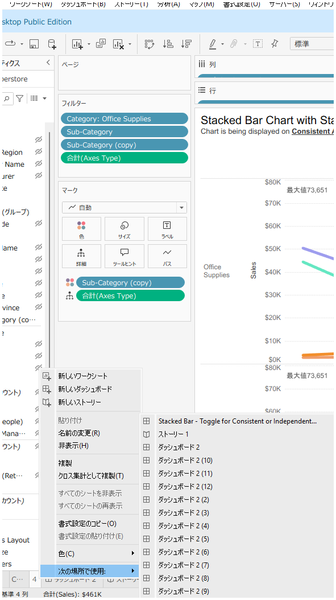
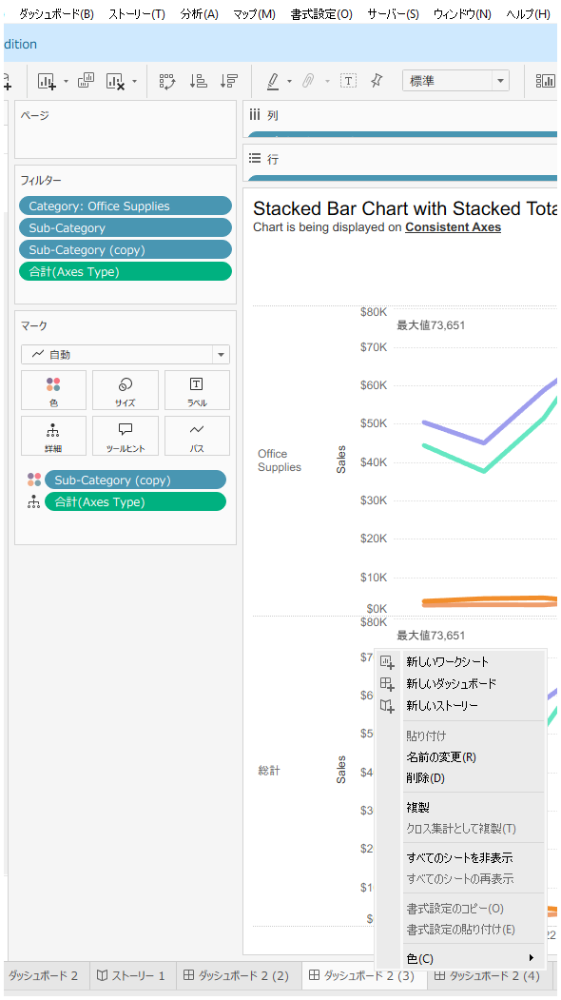
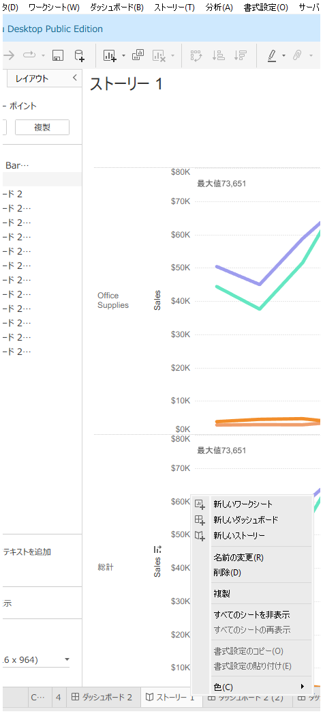
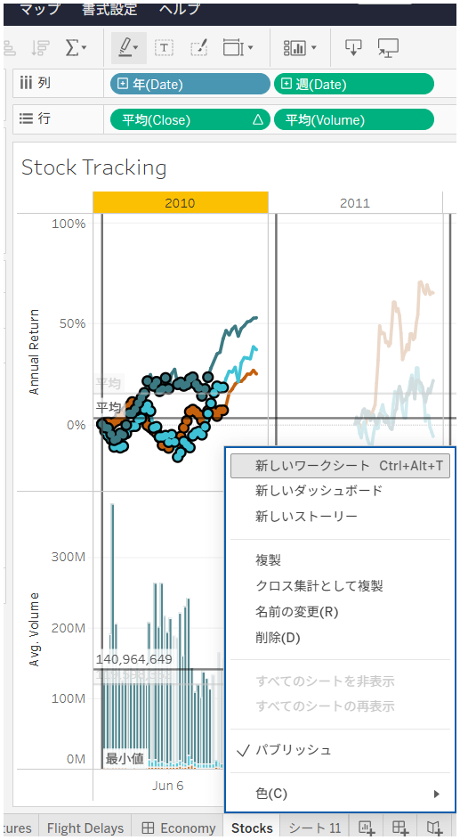
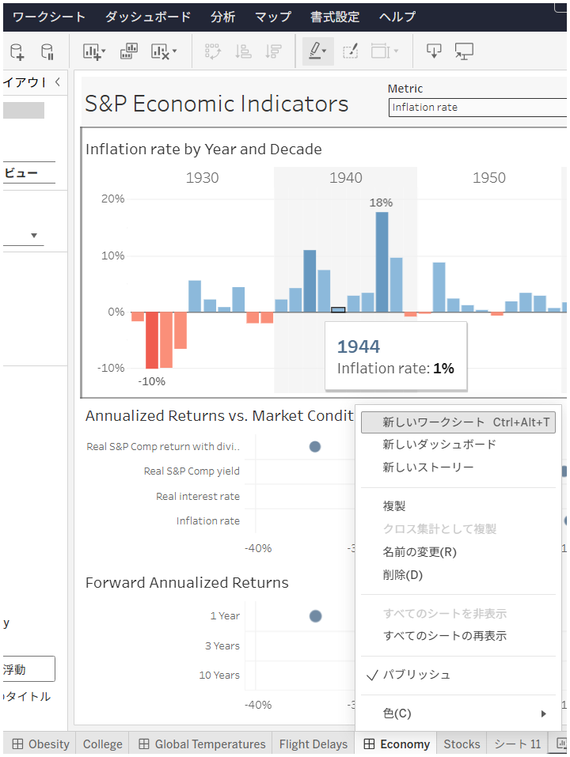
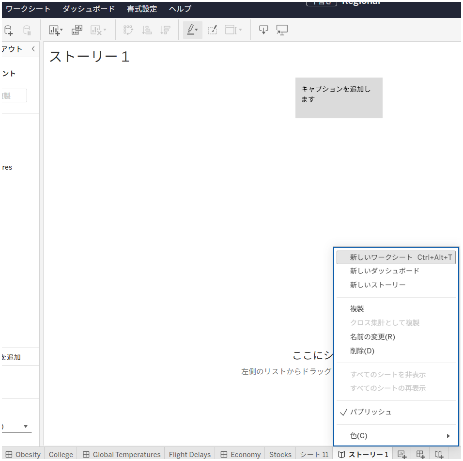

# シートタブコンテキストメニューへのアクセス

## 機能の違い

シートタブを右クリックした際に表示されるコンテキストメニューのオプションが、Tableau DesktopとTableau Cloudで異なります。

- **Desktop**: シート管理、ナビゲーション、高度な機能を含む包括的なコンテキストメニューオプションが利用可能
- **Cloud**: 管理機能やカスタマイズ機能が制限された、限定的なコンテキストメニューオプション

## 使用方法

### Tableau Desktop
1. ワークシート、ダッシュボード、またはストーリーのタブを右クリックします
2. 包括的なコンテキストメニューが表示され、様々なシート管理オプションにアクセスできます

#### ワークシートタブの場合

#### ダッシュボードタブの場合

#### ストーリータブの場合

### Tableau Cloud
1. ワークシート、ダッシュボード、またはストーリーのタブを右クリックします
2. 限定的なコンテキストメニューが表示され、基本的な操作のみが利用可能です

#### ワークシートタブの場合

#### ダッシュボードタブの場合

#### ストーリータブの場合

## 利用例・用途

### Tableau Desktop での活用場面
- **シート管理**: 複数シートの効率的な管理と整理
- **ナビゲーション**: ワークブック内での素早い移動
- **高度な機能**: シートの詳細設定やプロパティ変更
- **ワークフロー最適化**: 開発プロセスの効率化

### Tableau Cloud での制限
- 基本的なシート操作のみに限定
- 高度なシート管理機能は利用不可
- ワークブック編集の柔軟性が制限される

## 注意事項

- **Desktop**: より多くのシート管理オプションと高度な機能にアクセス可能
- **Cloud**: 基本的なコンテキストメニューオプションのみサポート
- Cloudでの制限は、Webベースの環境での技術的制約によるものです
- 具体的なメニュー項目の詳細や機能差については、今後の調査で追加予定です
- ワークブック開発の効率性において、DesktopとCloudで差が生じる可能性があります

## 参照

[GitHub Issue #89](https://github.com/mickitty0511/tableau-feature-parity/issues/89)