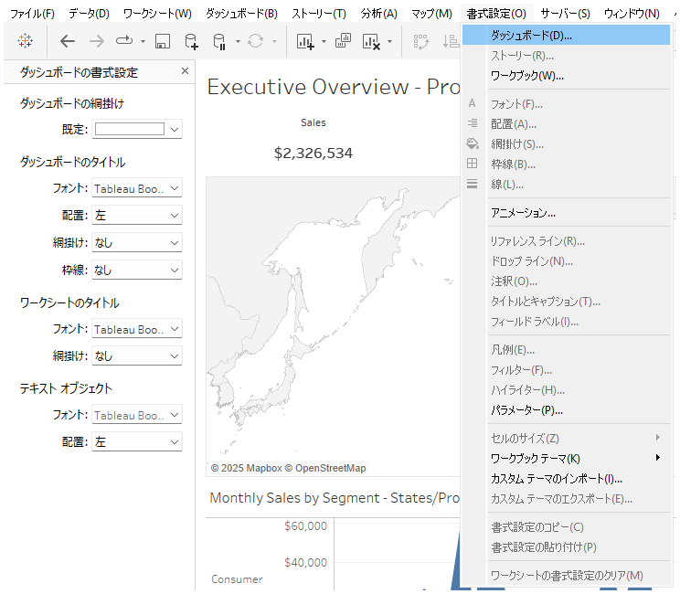

## 機能の違い
Tableau DesktopとTableau Cloudでは、ダッシュボードの書式設定へのアクセス方法が異なります。

- **Desktop**: 「ダッシュボード」タブ > 「書式設定」からアクセスします。
- **Cloud**: 「書式設定」タブ > 「ダッシュボード」からアクセスします。

## 使い方
### Tableau Desktopの場合
1. ワークシート上部の「ダッシュボード」タブをクリックします。
2. 「書式設定」を選択すると、ダッシュボード全体の書式設定メニューが表示されます。

### Tableau Cloudの場合
1. 画面上部の「書式設定」タブをクリックします。
2. 「ダッシュボード」を選択すると、書式設定メニューが表示されます。

## 備考
- 書式設定で利用できる項目やUIも一部異なる場合があります。
- 詳細は各バージョンの公式ドキュメントを参照してください。

---
参考: [GitHub Issue #1](https://github.com/mickitty0511/tableau-feature-parity/issues/1) 