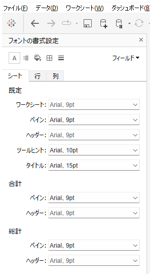
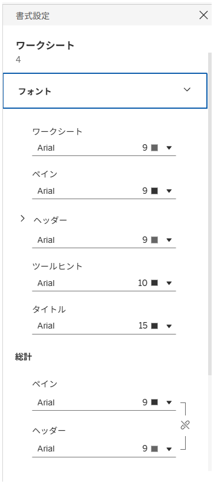

## 機能の違い
フォント、配置、シェーディング、境界線、線の書式設定をアイコンで管理する機能の利用可能性が、Tableau DesktopとTableau Cloudで異なります。

- **Desktop**: アイコンによる書式設定の管理機能が利用可能
- **Cloud**: アイコンによる書式設定の管理機能が制限的

## 使用方法
### Tableau Desktop
1. 書式設定したいオブジェクトを選択します
2. 書式設定パネルでアイコンを使用して各種書式設定を管理できます

### Tableau Cloud
1. 書式設定したいオブジェクトを選択します
2. 書式設定オプションが制限されており、アイコンによる直感的な操作が限定的です

## 注意事項
- Desktopでは、アイコンを使用してフォント、配置、シェーディング、境界線、線の書式設定を直感的に管理できます
- Cloudでは、同等の機能が制限されているか、異なるインターフェースで提供されています
- 詳細な操作手順や具体的な使用例は今後追加予定です

---
参考: [GitHub Issue #8](https://github.com/mickitty0511/tableau-feature-parity/issues/8)