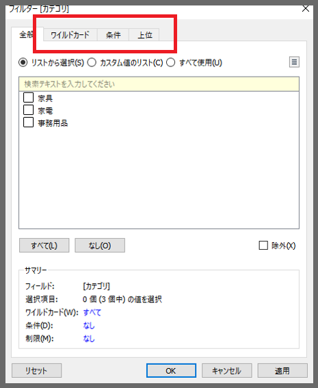
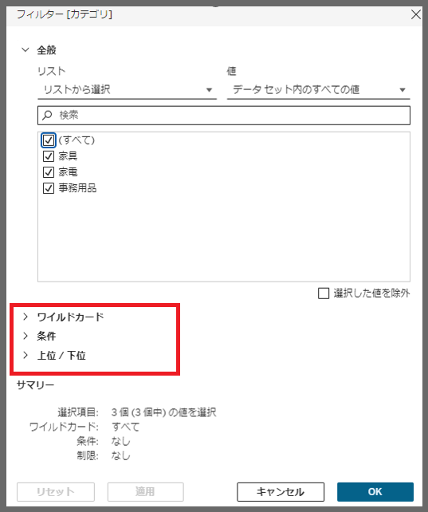

# Filter Edit Dialog

## Feature Differences
The filter edit dialog interface differs between Tableau Desktop and Tableau Cloud.

- **Desktop**: Detailed settings are displayed using tab switching
- **Cloud**: Displayed in accordion format on a single, vertically extended screen

## Usage Instructions

### Tableau Desktop
1. In the "Edit Filter" dialog, switch between General, Wildcard, Top, and Condition tabs to configure settings

### Tableau Cloud
1. In the "Edit Filter" dialog, General, Wildcard, Top, and Condition sections are displayed in accordion format. Click on a section to display detailed settings

Reference: [GitHub Issue #87](https://github.com/mickitty0511/tableau-feature-parity/issues/87)