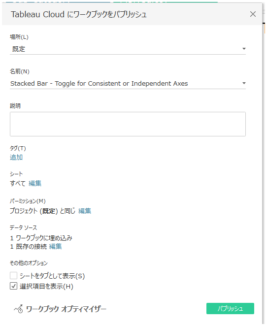
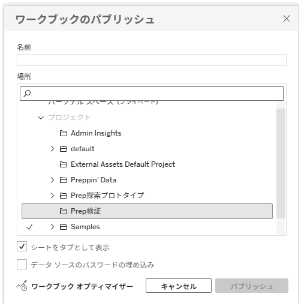
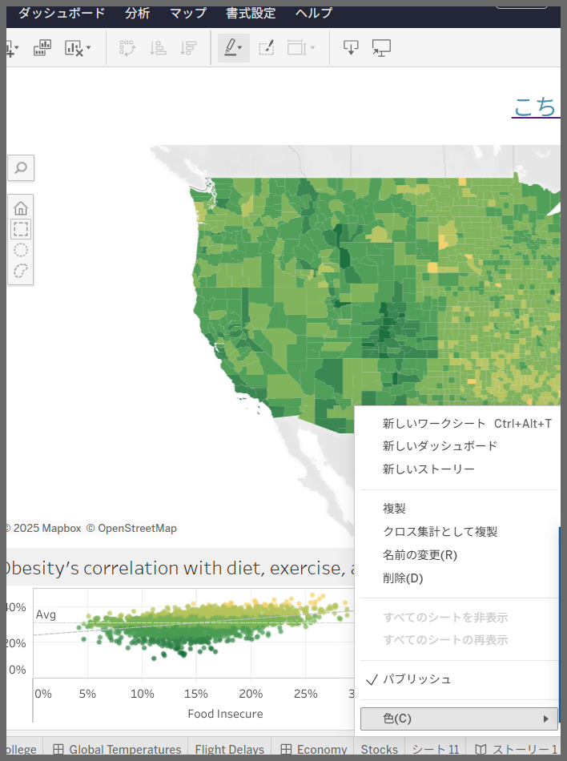

## 機能の違い
パブリッシュ時の説明、タグ、権限、および表示シートの更新機能は、Tableau Desktopでのみ利用可能です。

- **Desktop**: パブリッシュ時に詳細な設定（説明、タグ、パーミッション、表示対象のシート）を更新できます
- **Cloud**: パブリッシュボタンを押したあとのダイアログでは、ワークブック名の設定やプロジェクトを選択する、シートをタブとして表示するなど、データソースのパスワード埋め込みのみ可能。表示対象のシートはワークブック編集画面上で対応。説明、タグ、パーミッションはワークブック編集画面とは別画面で対応。

## 使用方法
### Tableau Desktop
1. ワークブックをサーバーにパブリッシュする際、「パブリッシュ」ダイアログが表示されます
2. ダイアログ内で以下の項目を更新できます：
   - **説明**: ワークブックの説明文を追加・編集
   - **タグ**: 検索性を向上させるためのタグを設定
   - **権限**: アクセス権限の詳細設定
   - **表示シート**: パブリッシュ対象のシートを選択

### Tableau Cloud
1. ワークブックをパブリッシュする際、基本的なダイアログのみが表示されます
2. シートをパブリッシュ対象とする場合はシートタブを右クリックし表示されるコンテキストメニューの「パブリッシュ」にチェックを入れます
3. ワークブック編集画面を離れ、Cloudのワークブック詳細情報画面に移動し、ワークブック名の横にある「infoアイコン」から設定。上記の「説明」と「タグ」の項目はそれぞれ「詳細」、「タグ」から変更します。パーミッションについては、ワークブック名の横にある3点リーダー(⋯)をクリックし表示されるメニューから「パーミッション」で変更します

## 使用例・活用場面
- **チーム運用**: ワークブックの説明とタグを統一して管理したい場合
- **権限管理**: パブリッシュ時に適切なアクセス権限を設定したい場合
- **シート管理**: 特定のシートのみをパブリッシュしたい場合
- **ドキュメント管理**: ワークブックの目的や使用方法を明確にしたい場合

## 注意点・考慮事項
- Tableau Cloudでは、パブリッシュ後にサーバー上でこれらの設定を個別に変更する必要があります
- Desktopでの一括設定により、運用効率が大幅に向上します
- 特に大規模なワークブック管理では、この機能差が運用上重要な影響を与える可能性があります
- 現在のところ、Cloudでのこの機能の追加予定は明確ではありません

## 影響範囲
この機能の違いは、以下の業務プロセスに影響を与えます：
- ワークブック管理プロセス
- 権限設定プロセス
- ドキュメント管理プロセス
- チーム間での情報共有プロセス

---
参考: [GitHub Issue #20](https://github.com/mickitty0511/tableau-feature-parity/issues/20)