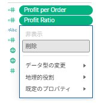
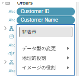
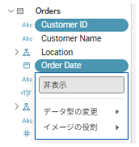

## Feature Differences
Tableau Desktop and Tableau Cloud show different context menu options when right-clicking on multiple selected fields in the data pane.

- **Desktop**: Multiple commands are available beyond "Hide" (e.g., grouping, creating folders, copying, etc.)
- **Cloud**: Only the "Hide" command is available

## Usage Instructions
### For Tableau Desktop
1. Select multiple fields in the data pane using Ctrl or Shift keys.
2. Right-click on the selected fields to display various command options.

Desktop examples:

### For Tableau Cloud
1. Select multiple fields in the data pane.
2. Right-click to display only the "Hide" command.

Cloud examples:

## Notes
- Desktop supports various operations beyond "Hide", including grouping, copying, and folder creation.
- Cloud currently only supports the "Hide" function.
- Specific commands, use cases, and impacts will be documented in future updates.

---
Reference: [GitHub Issue #2](https://github.com/mickitty0511/tableau-feature-parity/issues/2)