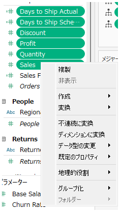

## 機能の違い
Tableau DesktopとTableau Cloudでは、データペインで複数のフィールドを選択して右クリックした際に表示されるコンテキストメニューの内容が異なります。

- **Desktop**: 「非表示」以外にも複数のコマンド（例：グループ化、フォルダ作成、コピーなど）が利用可能です。
- **Cloud**: 「非表示」コマンドのみ利用可能です。

## 使い方
### Tableau Desktopの場合
1. データペインで複数のフィールドをCtrlキーやShiftキーで選択します。
2. 選択した状態で右クリックすると、様々なコマンドが表示されます。

デスクトップ版の例：

### Tableau Cloudの場合
1. データペインで複数のフィールドを選択します。
2. 右クリックすると「非表示」コマンドのみが表示されます。

クラウド版の例：

## 備考
- Desktopでは「非表示」以外にも、グループ化やコピー、フォルダ作成など多様な操作が可能です。
- Cloudでは現時点で「非表示」のみとなっています。
- 実際のコマンドやユースケース、影響については今後追記予定です。

---
参考: [GitHub Issue #2](https://github.com/mickitty0511/tableau-feature-parity/issues/2) 