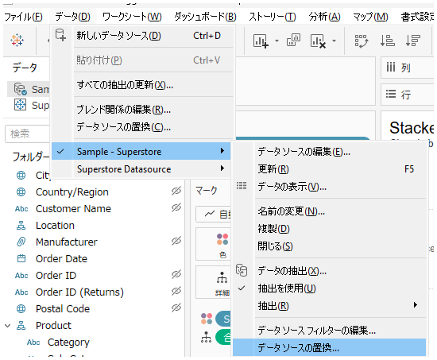
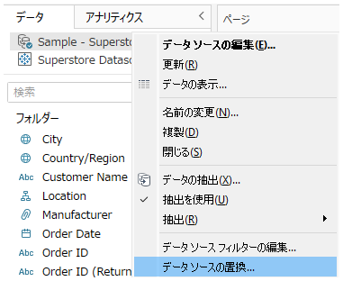
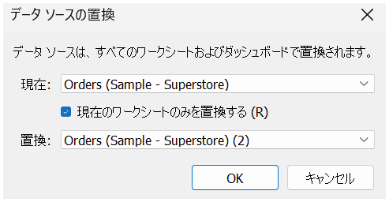
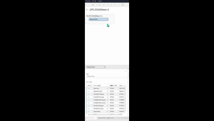

## 機能の違い
データソース置換コマンドへのアクセス方法が、Tableau DesktopとTableau Cloudで異なります。

- **Desktop**: データタブやデータペインから直接アクセス可能。「現在のワークシートのみ置換」オプションも利用可能
- **Cloud**: 制限されたアクセス方法でワークブック内全体に適用

## 使用方法
### Tableau Desktop
1. データペインでデータソースを右クリックします
2. コンテキストメニューから「データソースの置換」を選択します
3. または、「データ」タブから「データソースの置換」を選択します
4. 置換オプションを選択し、「現在のワークシートのみ置換」オプションを設定できます

Desktop例:

### Tableau Cloud
1. 限定的なデータソース置換機能のみ利用可能です
2. Desktopと比較して、アクセス方法や機能が制限されています

Cloud例:

## 注意事項
- Desktopでは、データタブまたはデータペインから簡単にデータソース置換コマンドにアクセスできます
- 「現在のワークシートのみ置換」オプションにより、特定のワークシートのみを対象とした置換が可能です
- Cloudでは、データペーン内の特定の箇所から唯一アクセスできます。現在のワークシートのみ置換オプションはなく、ワークブック内全体に適用されます。

## 使用例
- 開発環境から本番環境へのデータソース切り替え
- 類似構造を持つ異なるデータベースへの接続変更
- テスト用データから本番用データへの置換

---
参考: [GitHub Issue #9](https://github.com/mickitty0511/tableau-feature-parity/issues/9)