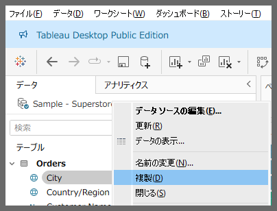
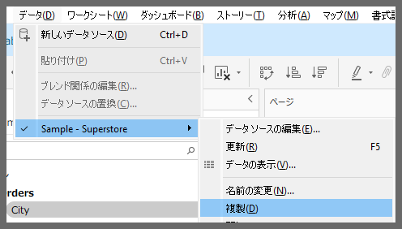
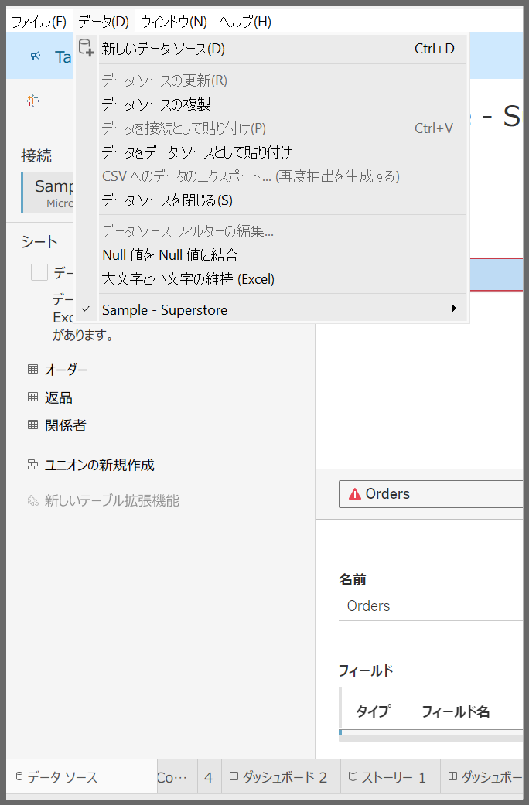
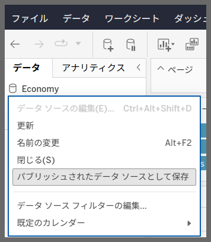
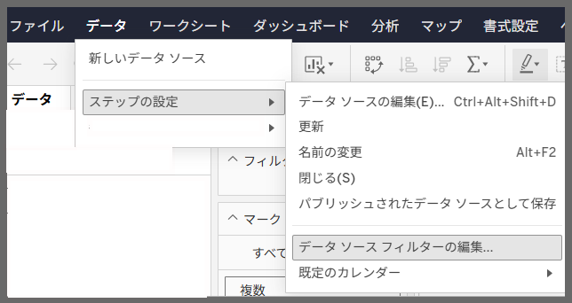
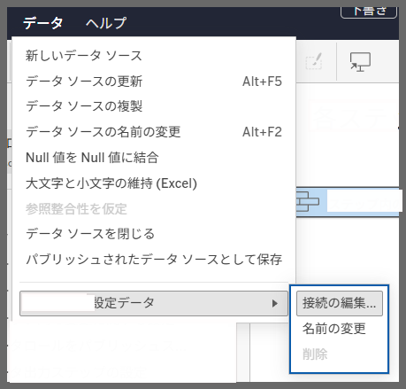

## Feature Differences
The ability to duplicate datasources differs between Tableau Desktop and Tableau Cloud.

- **Desktop**: Data source context menu includes duplicate option
- **Cloud**: No duplicate datasource functionality available

## Usage Instructions
### For Tableau Desktop
1. Right-click on the data source name in the Data Pane
2. Select "Duplicate" from the context menu
3. A duplicated data source will be created

Desktop Example:

### For Tableau Cloud
1. Right-click on the data source name in the Data Pane
2. Duplicate option is not available in the menu

Cloud Example:

## Usage Examples and Use Cases
- When you want to try different settings with the same data source
- When you need to create a backup before modifying data source settings
- When working on multiple analysis patterns in parallel

## Notes and Considerations
- Desktop allows creating duplicates of existing data sources with independent configuration changes
- Cloud currently does not support this functionality
- Duplicated data sources operate independently from the original data source

---
Reference: [GitHub Issue #74](https://github.com/mickitty0511/tableau-feature-parity/issues/74)