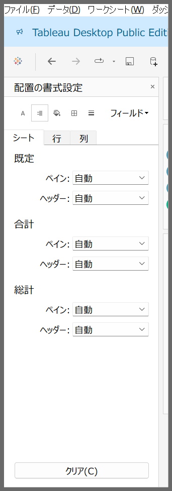
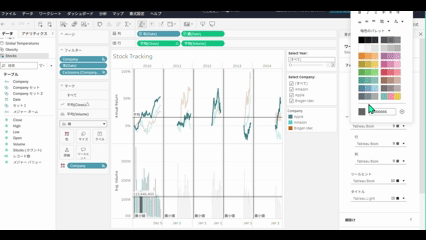

# 配置設定UI

## 機能の差異

Tableau DesktopとTableau Cloudでは、配置設定UIのインターフェースに違いがあります。

- **Desktop**: 書式設定で配置タブが個別で用意
- **Cloud**: 書式設定でフォント内に配置設定が組み込まれた状態

## 使用方法

### Tableau Desktop
1. 書式設定パネルで配置設定にアクセスします
2. 従来のインターフェースで配置オプションを設定できます

### Tableau Cloud
1. 書式設定タブからワークシートでフォント設定にアクセスします
2. ヘッダなどの設定から配置オプションを設定できます

## 注意事項と制約

- **Desktop**: フォント設定とは別で配置設定が設けられており、設定がコンパクト
- **Cloud**: フォントの設定に組み込まれたことで、フォントの設定で情報量が多くなりDesktopユーザには扱いにくい

## 参考

[GitHub Issue #85](https://github.com/mickitty0511/tableau-feature-parity/issues/85)