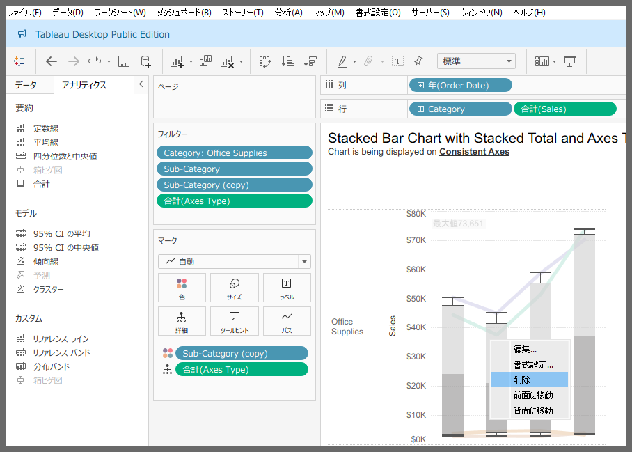
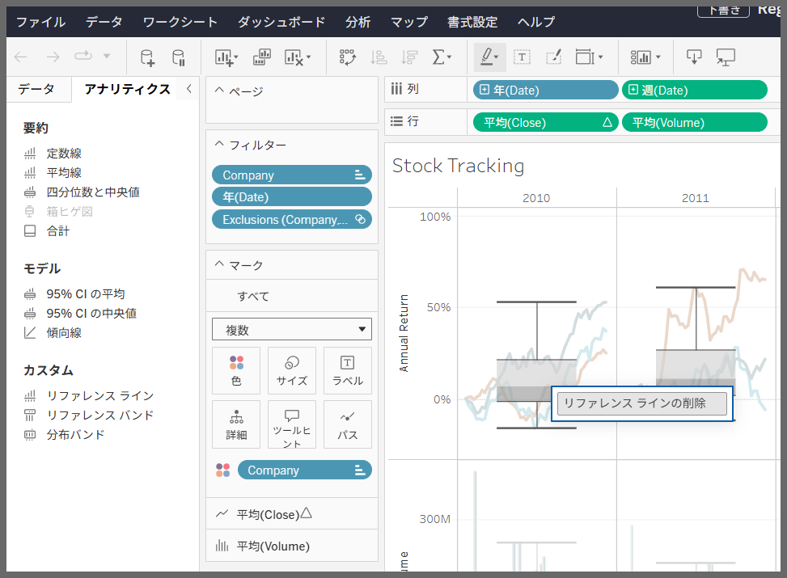

## 機能の違い
Tableau DesktopとCloudでは、箱ひげ図機能のインターフェースとオプションが異なります。

- **Desktop**: アナリティクスペーンにて要約とカスタムで表示あり。より詳細な書式設定などのコンテキストメニューが利用可能
- **Cloud**: アナリティクスペーンにて要約のみです。コンテキストメニューでは削除のみ可能。

## 使用方法
### Tableau Desktop
1. アナリティクスペーン > 箱ひげ図を選択
2. 右クリックで表示されるコンテキストメニューから書式設定など詳細な設定が可能

### Tableau Cloud
1. アナリティクスペーン > 箱ひげ図を選択
2. 右クリックで表示されるコンテキストメニューから削除コマンドのみアクセス可能

## 注意事項・考慮点
- Desktop版では色設定など詳細な書式設定が可能ですが、Cloud版では削除機能のみに限定
- 箱ヒゲ図のオプションがDesktopでは要約とカスタムで表示されていますが、Cloudでは要約のみです。

---
参照: [GitHub Issue #73](https://github.com/mickitty0511/tableau-feature-parity/issues/73)