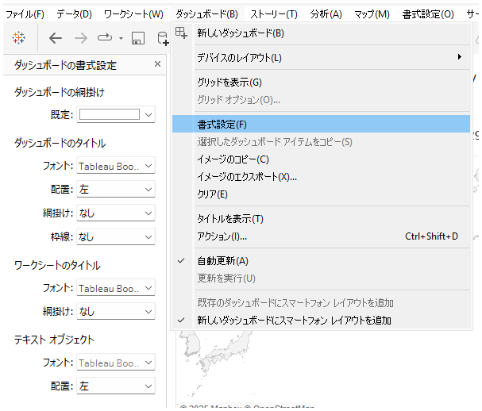
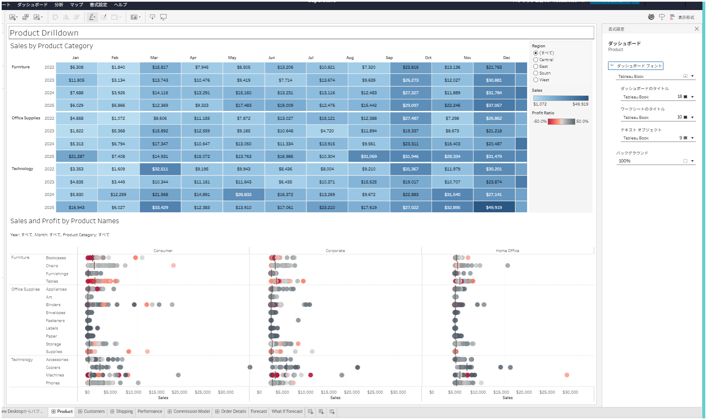

## Feature Differences
Tableau Desktop and Tableau Cloud have different methods for accessing dashboard formatting.

- **Desktop**: Access via "Dashboard" tab > "Formatting"
- **Cloud**: Access via "Formatting" tab > "Dashboard"

## Usage Instructions
### For Tableau Desktop
1. Click the "Dashboard" tab at the top of the worksheet.
2. Select "Formatting" to display the dashboard formatting menu.

### For Tableau Cloud
1. Click the "Formatting" tab at the top of the screen.
2. Select "Dashboard" to display the formatting menu.

## Notes
- The formatting options and UI available may differ between versions.
- Refer to the official documentation for each version for detailed information.

---
Reference: [GitHub Issue #1](https://github.com/mickitty0511/tableau-feature-parity/issues/1)