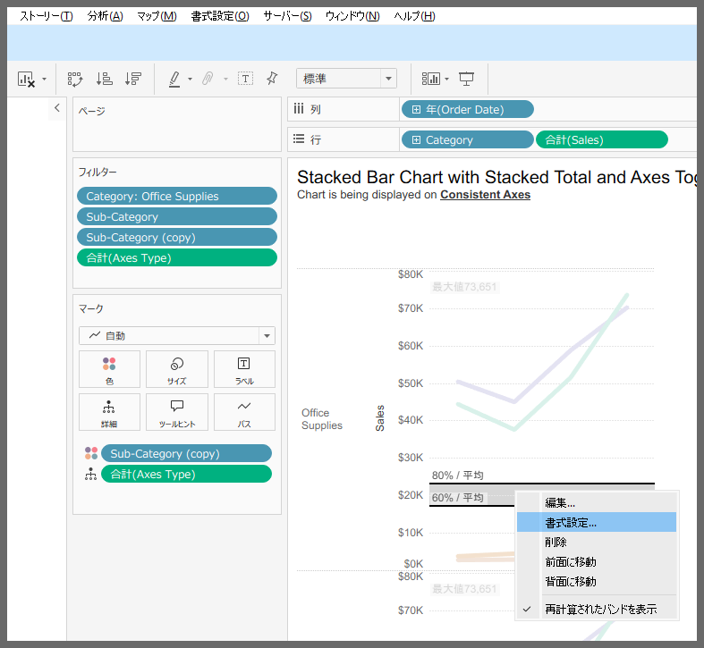
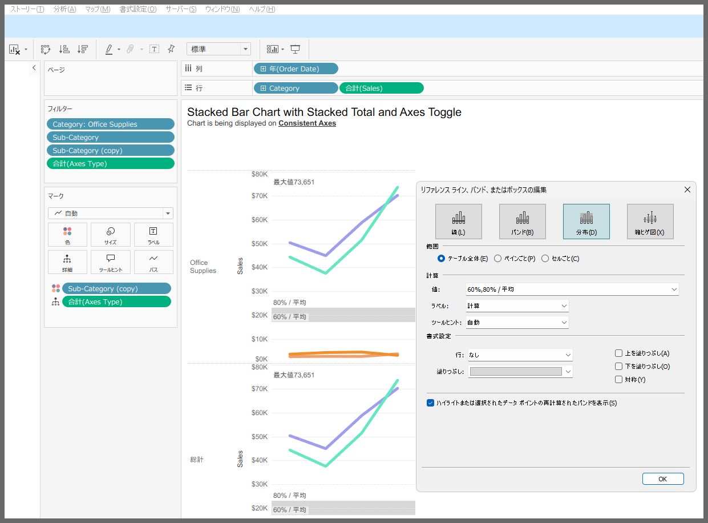
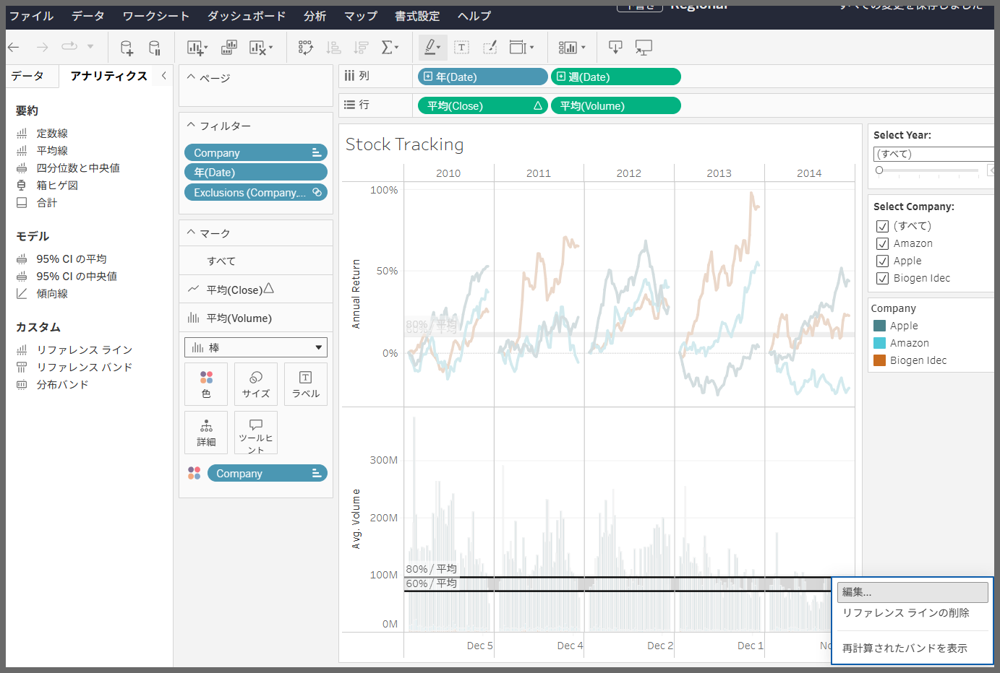
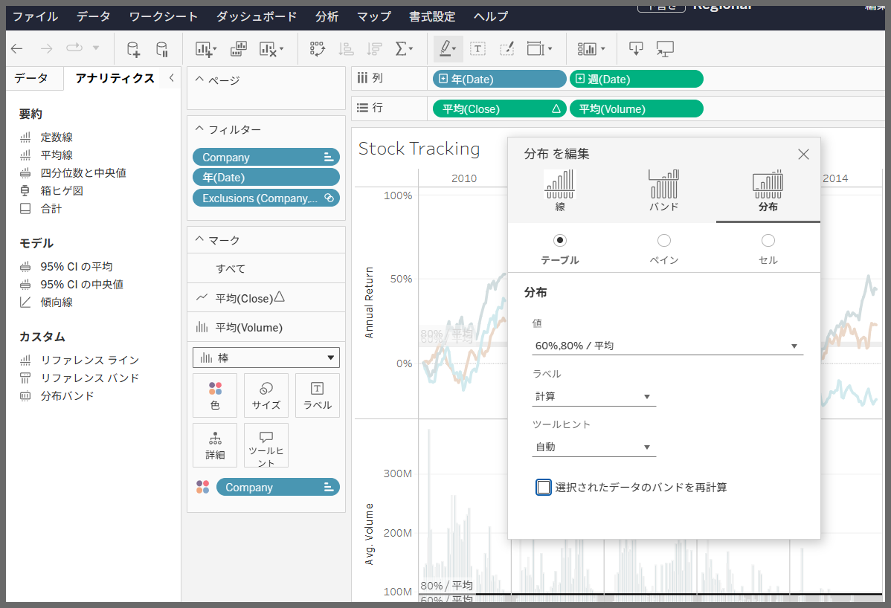

# 分布バンド

## 機能の差異

Tableau DesktopとTableau Cloudでは、分布バンド機能に違いがあります。

- **Desktop**: 完全な分布バンドオプションが利用可能
- **Cloud**: 限定的な分布バンド機能

## 使用方法

### Tableau Desktop
1. ワークシートで分布バンドを右クリックします
2. 書式設定や表示位置を前後に変更するオプションにアクセスできます

### Tableau Cloud
1. ワークシートで分布バンドを右クリックします
2. 編集画面で設定を変更できますが、Desktopよりも設定は限られます

## 注意事項と制約

- **Desktop**: フル機能の分布バンドオプションが利用可能で、詳細な設定とカスタマイズが可能です
- **Cloud**: 分布バンドの色などの書式設定は制限されており、一部のオプションのみが利用可能です

## 参考

[GitHub Issue #75](https://github.com/mickitty0511/tableau-feature-parity/issues/75)