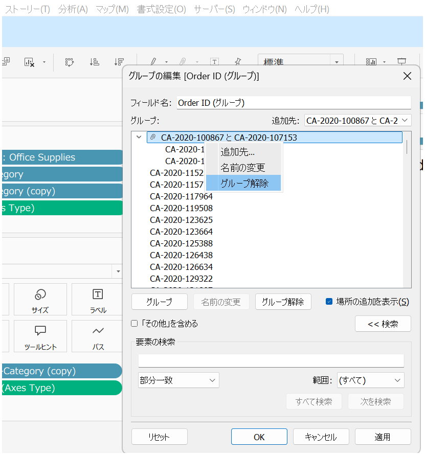
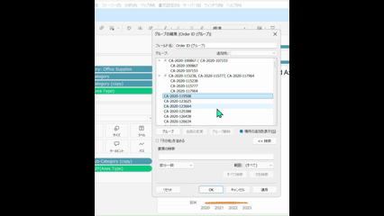
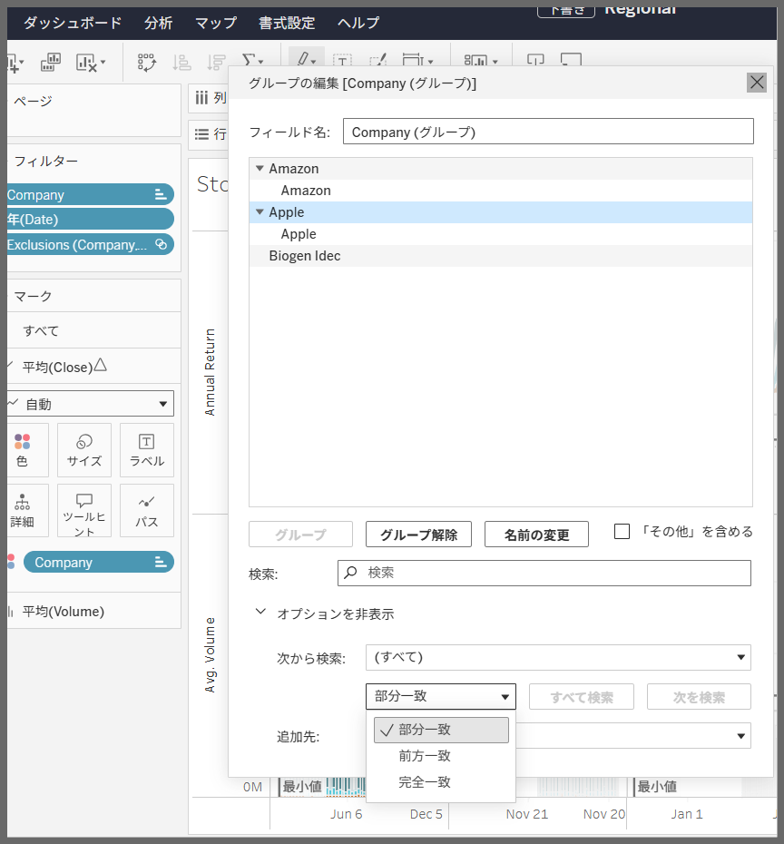
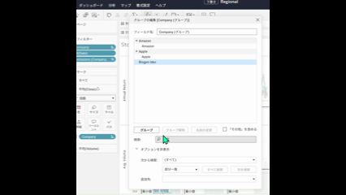

# グループの編集

## 機能差異
グループの編集機能は、Tableau DesktopとTableau Cloudで異なります。

- **Desktop**: より包括的なグループ編集オプションが利用可能
- **Cloud**: グループ管理用にシンプル化されたインターフェース

## 使用方法

### Tableau Desktopでの操作
1. データペインでグループのフィールドを右クリックし、コンテキストメニューから「グループの編集」を選択
2. グループメンバーの追加・削除、グループの削除は画面下内のみのボタンとグループメンバーを右クリック後に表示されるコンテキストメニューで実行
3. 場所の追加を表示オプションを有効化で、追加されたグループメンバーにハイライトが当たる機能が有効化される
4. 「<<検索」ボタンからグループ内を検索できる

### Tableau Cloudでの操作
1. データペインでグループのフィールドを右クリックし、コンテキストメニューから「グループの編集」を選択
2. グループメンバーの追加・削除、グループの削除は画面下内のみのボタンで実行
3. 追加されたグループメンバーにハイライトが当たる機能は常に有効化されている
4. 「オプションを表示」セクションをクリックすると、グループ内検索できる

## 注意点・考慮事項
- Desktop版では、グループメンバーを右クリック後に表示されるコンテキストメニューでグループメンバーの追加・削除を簡単に行える機能が用意されている
- Cloud版では常時ボタン操作が必要

参考: [GitHub Issue #88](https://github.com/mickitty0511/tableau-feature-parity/issues/88)