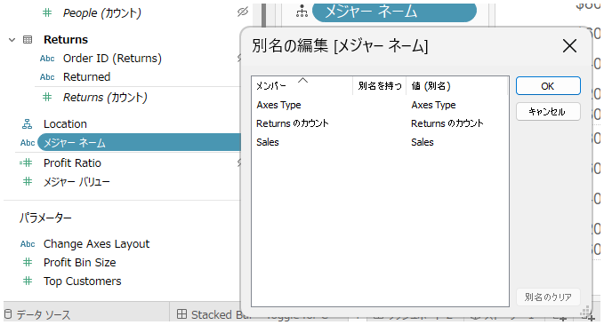
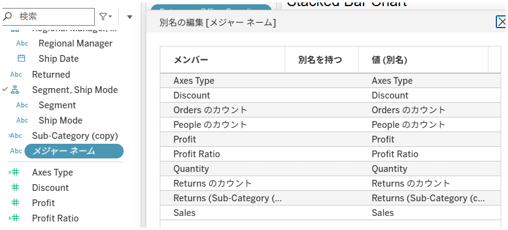

## 機能の違い
Tableau DesktopとTableau Cloudでは、データペインでメジャーネームのコンテキストメニューから「別名の編集」を選択した際に表示されるフィールドが異なります。

- **Desktop**: ワークシートで実際に使用されているメジャーフィールドのみが表示されます。
- **Cloud**: すべてのメジャーフィールドが表示されます。

## 使い方
### Tableau Desktopの場合
1. データペインでメジャーネームを右クリックし、「別名の編集」を選択します。
2. ワークブック内にあるワークシートにて使用中のメジャーフィールドのみがリストに表示され、別名の編集が可能です。

### Tableau Cloudの場合
1. データペインでメジャーネームを右クリックし、「別名の編集」を選択します。
2. すべてのメジャーフィールドがリストに表示され、別名の編集が可能です。

## 備考
- Desktopでは、未使用のメジャーフィールドは「別名の編集」リストに表示されません。
- Cloudでは、未使用のフィールドも含めて全て表示されます。
- この違いにより、Cloudでは事前に一括で別名の指定がしやすい一方、Desktopではワークブック内のワークシートに使用中のフィールドのみを効率的に編集できます。

---
参考: [GitHub Issue #3](https://github.com/mickitty0511/tableau-feature-parity/issues/3) 