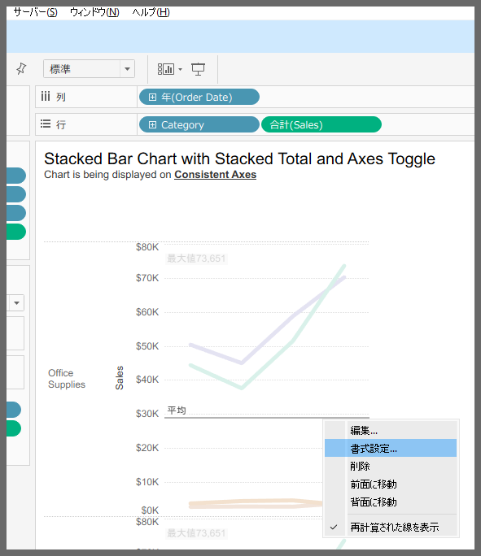
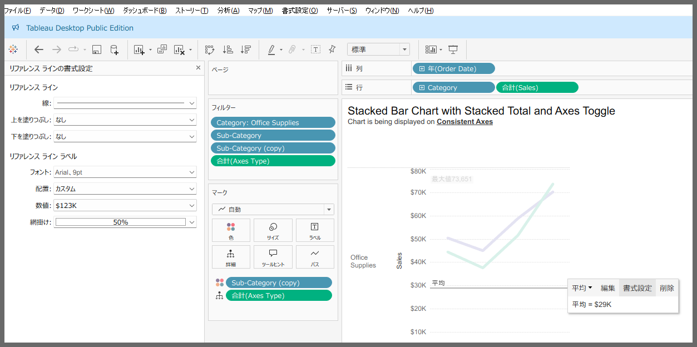
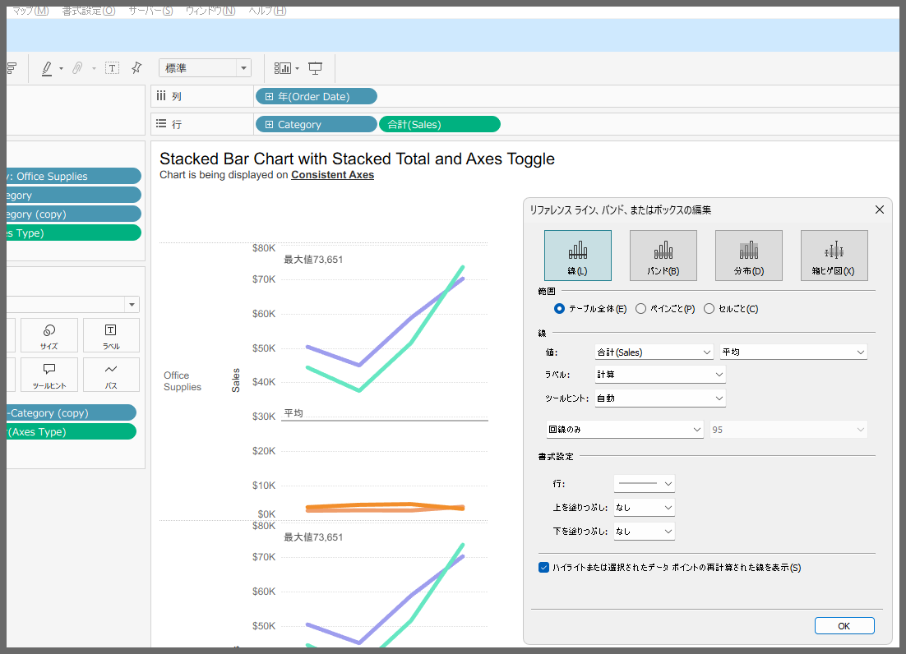
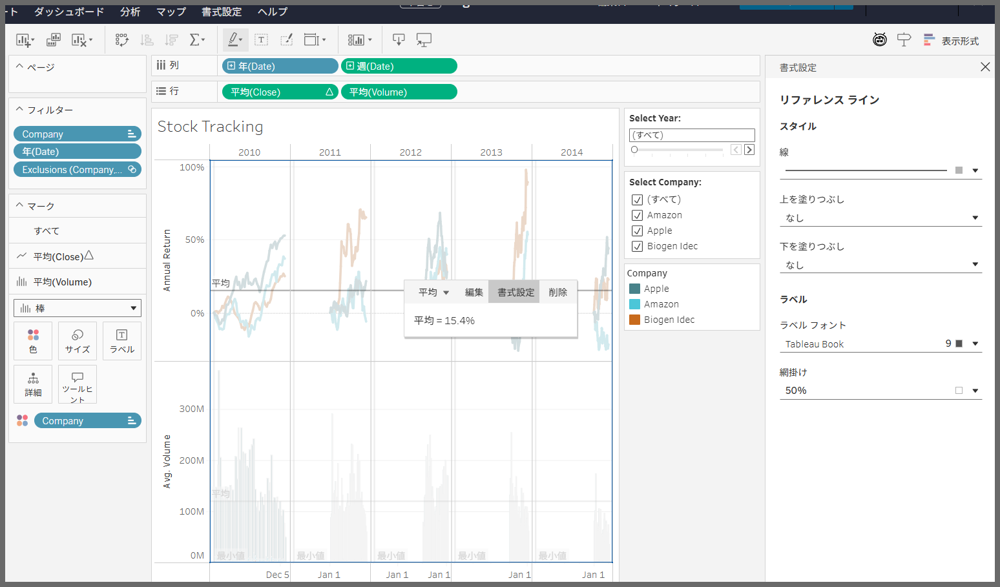
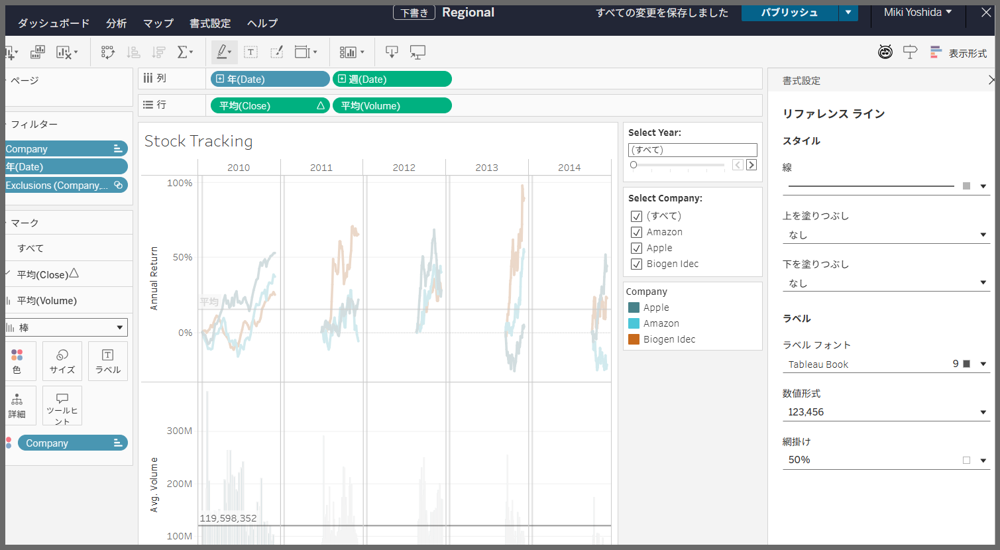
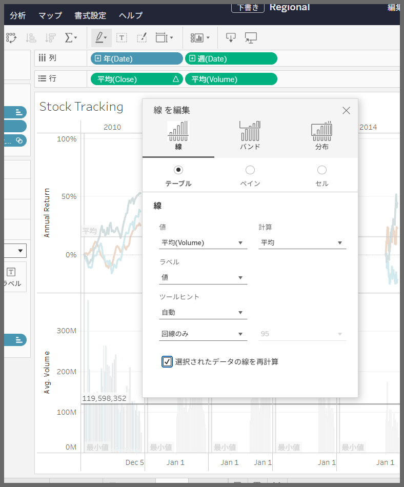

# Reference Line Formatting

## Feature Differences

The access methods and layout for reference line formatting options differ between Tableau Desktop and Tableau Cloud.

- **Desktop**: Accessible from menus displayed via left-click or right-click
- **Cloud**: Accessible only from menus displayed via left-click

## Usage Instructions

### Tableau Desktop
1. Left-click or right-click on the reference line in the worksheet
2. Access "Format" from the context menu
3. Use the detailed formatting UI to fine-tune labels displayed on the reference line, line color, style, thickness, and other settings

#### Reference Line Formatting Feature Comparison

| Feature | Tableau Desktop | Tableau Cloud |
|-|-|-|
| Change line color | Available | Available |
| Change line style | Available | Available |
| Adjust line thickness | Available | Available |
| Edit labels (value, calculation method, custom) | Available | Available |
| Label formatting (font, etc.) | Available | Available |
| Number format for values | Available (regardless of label type) | Available (displayed only for numeric values) |
| Access to formatting settings | Access to formatting and other common options from left/right-click menu | Right-click shows only edit/delete options. Formatting options are additionally displayed from left-click menu |
| Manage multiple reference lines | Available | Available |

### Tableau Cloud
1. Left-click on the reference line in the worksheet
2. Formatting changes can be made from "Format" in the following context menu
3. Fill Up/Down is only accessible from the "Format", which is accessible in the edit dialog for Desktop  

## Reference

[GitHub Issue #77](https://github.com/mickitty0511/tableau-feature-parity/issues/77)