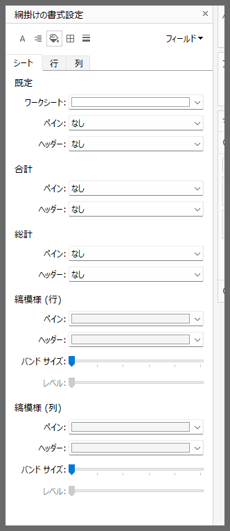
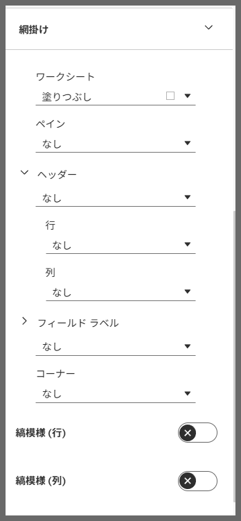

# Shading Settings UI

## Feature Differences
The shading settings UI interface differs between Tableau Desktop and Cloud.

- **Desktop**: More detailed setting options are available
- **Cloud**: Simplified settings interface

## Usage Instructions
### Tableau Desktop
1. Format (tab) > Shading
2. Striping options are always enabled. Set to "None" if no color is desired.

### Tableau Cloud
1. In worksheet edit screen, go to Format > Worksheet
2. Access the Shading section
3. Striping options can be toggled on/off with enable/disable button *Initially disabled by default
4. Use the button to disable if no color is desired

---
Reference: [GitHub Issue #72](https://github.com/mickitty0511/tableau-feature-parity/issues/72)