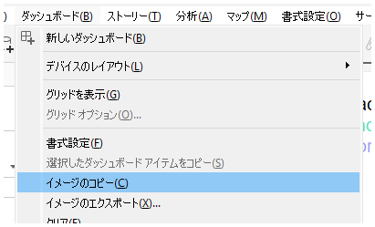
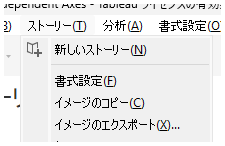
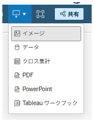

<!-- ダウンロードアイコン定義 -->
<link rel="stylesheet" href="https://fonts.googleapis.com/css2?family=Material+Symbols+Outlined:opsz,wght,FILL,GRAD@24,200,0,0&icon_names=download" />
<!-- ダウンロードアイコン定義 -->

## 機能の違い
ダッシュボード・ストーリー画像のエクスポート機能の操作方法が、Tableau DesktopとTableau Cloudで異なります。

- **Desktop**: コンテキストメニューまたはダッシュボード・ストーリータブから「イメージをエクスポート」を選択
- **Cloud**: 権限がある前提で、Creatorのみワークブック編集画面のツールバーから実行。Unlicensed以外でCreatorを含むすべてのユーザーはビュー閲覧時のダウンロードボタンから実行

## 使用方法
### Tableau Desktop
1. エクスポートしたいダッシュボードまたはストーリーを開きます
2. 右クリックしてコンテキストメニューを表示するか、ダッシュボード・ストーリータブを選択します
3. 「イメージのエクスポート」を選択します

### Tableau Cloud
A. Creatorの場合
方法1: ワークブック編集画面から実行
1. エクスポートしたいダッシュボードまたはストーリーを開きます
2. ツールバーのdownloadアイコンからイメージを選択

方法2: ビュー閲覧画面から実行
(権限がある場合前提で)downloadボタンをクリックし、イメージを選択

B. 一般ユーザーの場合： 上記の方法2のみ

## 注意事項
- Desktopでは、コンテキストメニューまたはタブメニューから直接画像エクスポートが可能です
- Cloudでは、ユーザーの権限レベル（CreatorまたはViewer）によって操作方法が異なります
- 権限によっては、一部のユーザーがエクスポート機能を使用できない場合があります

## 使用例
- レポート作成時のダッシュボード画像の取得
- プレゼンテーション資料への組み込み用画像の作成
- 外部文書への可視化結果の埋め込み

---
参考: [GitHub Issue #5](https://github.com/mickitty0511/tableau-feature-parity/issues/5)