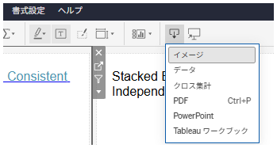

<!-- Download icon definition -->
<link rel="stylesheet" href="https://fonts.googleapis.com/css2?family=Material+Symbols+Outlined:opsz,wght,FILL,GRAD@24,200,0,0&icon_names=download" />
<!-- Download icon definition -->

## Feature Differences
The operation methods for exporting dashboard and story images differ between Tableau Desktop and Tableau Cloud.

- **Desktop**: Select "Export Image" from context menu or dashboard/story tab
- **Cloud**: With appropriate permissions, Creators can execute from toolbar in workbook edit screen. All users except Unlicensed (including Creators) can execute from download button when viewing

## Usage Instructions
### Tableau Desktop
1. Open the dashboard or story you want to export
2. Right-click to display context menu or select the dashboard/story tab
3. Select "Export Image"

Desktop examples:

### Tableau Cloud
A. For Creators
Method 1: Execute from workbook edit screen
1. Open the dashboard or story you want to export
2. Select image from the download icon in the toolbar

Method 2: Execute from view screen
(With appropriate permissions) Click the download button and select image

B. For general users: Method 2 only

Cloud examples:

## Considerations
- Desktop allows direct image export from context menu or tab menu
- Cloud operation methods differ depending on user permission level (Creator or Viewer)
- Some users may not be able to use export functionality depending on permissions

## Use Cases
- Obtaining dashboard images for report creation
- Creating images for embedding in presentation materials
- Embedding visualization results in external documents

---
Reference: [GitHub Issue #5](https://github.com/mickitty0511/tableau-feature-parity/issues/5)