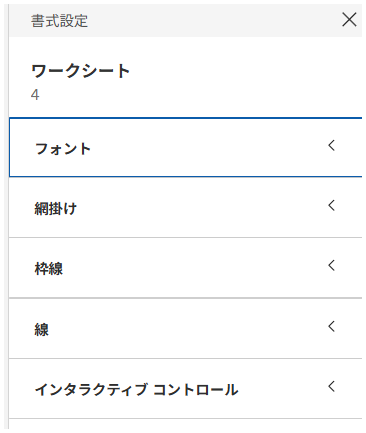

## Feature Differences
The availability of icon-managed formatting features for font, alignment, shading, border, and line settings differs between Tableau Desktop and Tableau Cloud.

- **Desktop**: Icon-based formatting management features are available
- **Cloud**: Icon-based formatting management features are limited

## Usage Instructions
### Tableau Desktop
1. Select the object you want to format
2. Use icons in the formatting panel to manage various formatting settings

Desktop example:

### Tableau Cloud
1. Select the object you want to format
2. Formatting options are limited, with restricted intuitive icon-based operations

Cloud examples:

## Considerations
- Desktop allows intuitive management of font, alignment, shading, border, and line formatting using icons
- Cloud has equivalent features that are limited or provided through different interfaces
- Detailed operation procedures and specific use cases will be added in future updates

---
Reference: [GitHub Issue #8](https://github.com/mickitty0511/tableau-feature-parity/issues/8)