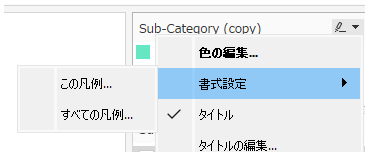
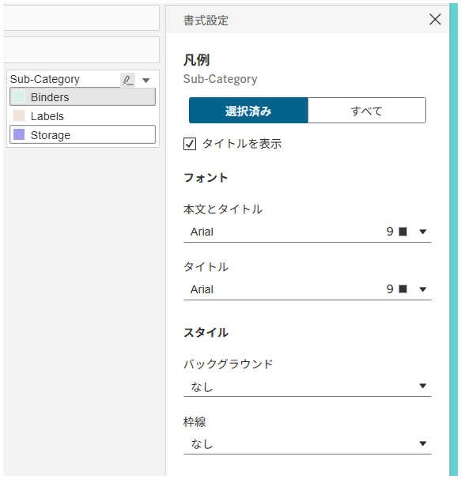

## Feature Differences
Access methods for formatting legend, parameter, and filter cards differ between Tableau Desktop and Tableau Cloud.

- **Desktop**: Method of selecting one or all cards for formatting
- **Cloud**: Method of formatting all cards with seamless tab switching

## Usage Instructions
### Tableau Desktop
1. Right-click on the legend, parameter, or filter card you want to format
2. From the context menu that appears, you can choose whether to apply formatting to the selected card or all cards
3. To switch between selected card and all cards, you need to repeat the same operation from step 1, which lacks seamlessness

### Tableau Cloud
1. Access the formatting pane
2. Use tab switching to manage formatting for selected cards and all cards (legend, parameter, filter) with a seamless UI

## Considerations
- Desktop allows you to select specific cards for individual formatting or apply to all cards in bulk
- Cloud provides unified access to selected cards or all card types through tab switching, enabling more intuitive operations

## Use Cases
- Adjusting legend colors and font sizes
- Setting parameter control styles
- Customizing filter card appearance
- Achieving unified dashboard design

---
Reference: [GitHub Issue #4](https://github.com/mickitty0511/tableau-feature-parity/issues/4)