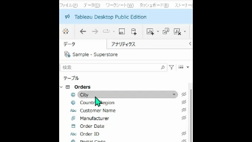
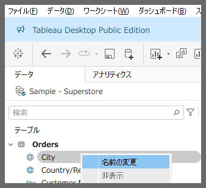
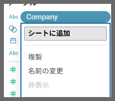

# Rename Field in Data Pane

## Feature Differences

The method for renaming fields in the data pane differs between Tableau Desktop and Tableau Cloud.

- **Desktop**: Multiple rename options are available including long-click and context menu
- **Cloud**: Rename functionality in the data pane is available only through the context menu

## Usage Instructions

### Tableau Desktop
1. Long-click on a field name in the data pane to edit it directly
2. Alternatively, right-click on the field and select "Rename" from the context menu

### Tableau Cloud
1. Field renaming in the data pane is limited
2. Only basic rename functionality is available

## Reference

[GitHub Issue #76](https://github.com/mickitty0511/tableau-feature-parity/issues/76)