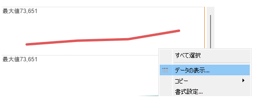
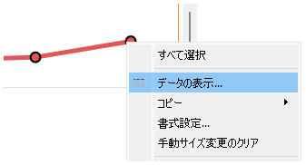
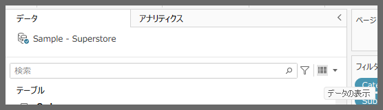
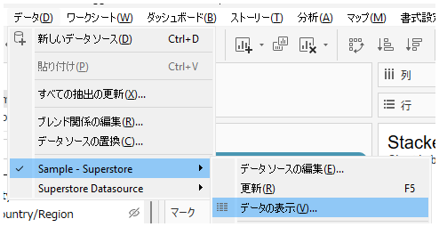
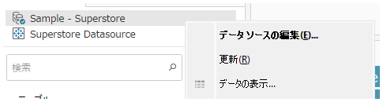
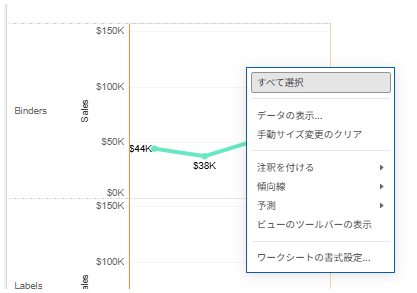
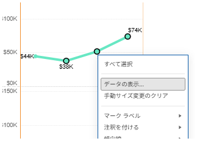

## Feature Differences
Access locations for the Show Data command differ between Tableau Desktop and Tableau Cloud.

- **Desktop**: Context menu from blank areas of worksheet view (canvas), context menu from selected data, right side of data pane search, "Data" tab > [each data source name] > "View Data", context menu from data sources within data pane, Analytics tab
- **Cloud**: Context menu from blank areas of worksheet view and context menu from selected data only

## Usage Instructions
### Tableau Desktop
Multiple methods are available to access the Show Data command:

Method 1: From blank areas of worksheet view
1. Right-click on a blank area of the worksheet
2. Select "View Data" from the context menu

Method 2: From selected data
1. Select the data you want to display
2. Right-click and select "View Data" from the context menu

Method 3: From data pane search area
1. Click the icon to the right of the search box in the data pane

Method 4: From Data tab
1. Click the "Data" tab
2. Select the target data source and click "View Data"

Method 5: From data source context menu
1. Right-click on a data source name in the data pane
2. Select "View Data" from the context menu

Method 6: From Analytics tab
1. Click the "Analytics" tab
2. Click "View Data"

### Tableau Cloud
Access is available through limited methods only:

Method 1: From blank areas of worksheet view
1. Right-click on a blank area within the worksheet view
2. Select "View Data" from the context menu

Method 2: From selected data
1. Select the data you want to display
2. Right-click and select "View Data" from the context menu

## Considerations
- Desktop provides access to the Show Data command through 6 different methods
- Cloud only supports 2 methods using context menus
- Access from data pane search area, Data tab, data source context menu, and Analytics tab is not available in Cloud

## Use Cases
- Checking data source contents
- Verifying raw data before filtering
- Data quality checks
- Data validation during debugging

---
Reference: [GitHub Issue #6](https://github.com/mickitty0511/tableau-feature-parity/issues/6)