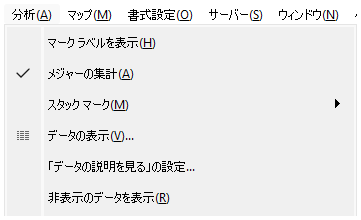
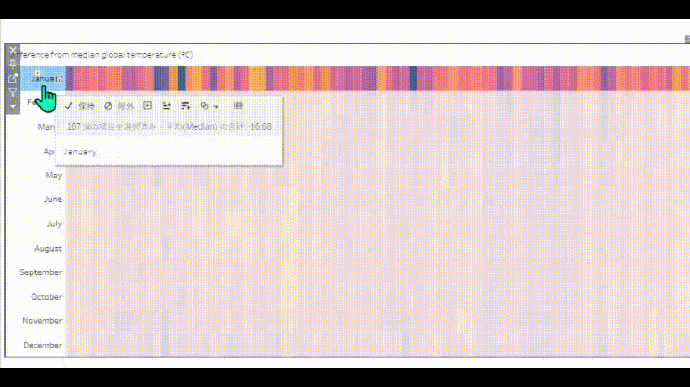
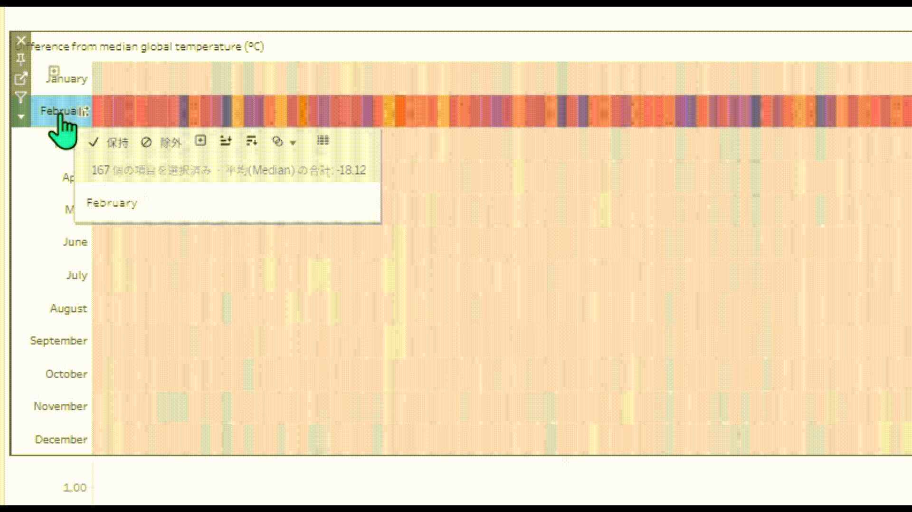

## 機能の違い
アナリティクスタブの「非表示のデータを表示」コマンドで非表示値を再表示する機能は、Tableau Desktopでのみ利用可能です。

- **Desktop**: アナリティクスタブに「非表示のデータを表示」コマンドがあり、非表示にした値を再表示できます
- **Cloud**: この機能は利用できません（アナリティクスタブに該当コマンドが存在しません）

## 使用方法
### Tableau Desktopの場合
1. ワークシートでデータポイントを右クリックし、「除外」または「データの非表示」を選択してデータを非表示にします
2. アナリティクスタブを開きます
3. 「非表示のデータを表示」コマンドをクリックします
4. 非表示にしていたデータが再表示されます

Desktopでの例:

### Tableau Cloudの場合
1. 任意の列・行を右クリックで選択し「非表示」コマンドを選択 
※この操作以外ではコマンドが表示されない場合があります
2. 再度、手順1と同じように右クリックで選択すると「非表示のデータを表示」コマンドが表示
※アナリティクスタブでは「非表示のデータを表示」コマンドは表示されません

Cloudでの例:

## 使用例・活用場面
- データ分析中に一時的に特定のデータポイントを除外し、後で再表示したい場合
- 外れ値を一時的に非表示にして分析を行い、後でその影響を確認したい場合
- データクリーニング作業において、問題のあるデータを一時的に除外し、後で再検討したい場合

## 注意事項と考慮点
- **Desktopでは容易に操作可能**: Tableau Desktopでは常に非表示のデータの表示操作がデータを選択不要でコマンド一つで容易に可能ですが、Tableau Cloudでは任意の行・列を選択するなど特定の方法で選択した場合に表示されます
- **運用上重要**: 非表示にしたデータを簡単に復元できる機能のため、データ分析ワークフローにおいて重要な役割を果たします

---
参考: [GitHub Issue #23](https://github.com/mickitty0511/tableau-feature-parity/issues/23)