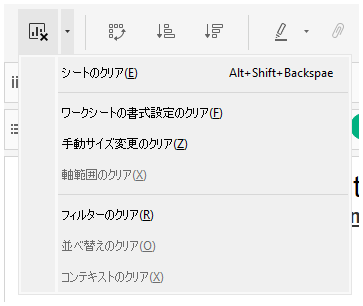
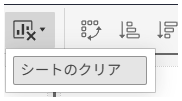

## Feature Differences
Worksheet clear command options in the toolbar differ between Tableau Desktop and Tableau Cloud.

- **Desktop**: Clear manual sizes, clear axis ranges, clear filters, clear sorts, clear context
- **Cloud**: Clear worksheet only

## Usage Instructions
### Tableau Desktop
Multiple detailed clear options are available:

1. Click the "Clear Sheet" button in the toolbar
2. You can choose from the following options:
   - Clear manual sizes
   - Clear axis ranges
   - Clear filters
   - Clear sorts
   - Clear context
   - Clear all (entire worksheet)

Desktop example:

### Tableau Cloud
Only limited clear options are available:

1. Click the "Clear Sheet" button in the toolbar
2. Only "Clear Worksheet" option is selectable

Cloud example:

## Considerations
- Desktop allows individual clearing of specific elements (manual sizes, axis ranges, filters, sorts, context)
- Cloud only allows clearing the entire worksheet; individual element clearing is not possible
- Consider using the Desktop version when diverse clearing operations are needed for efficiency

## Use Cases
- Resetting filter settings
- Initializing axis ranges
- Removing sort settings
- Clearing manually set sizes
- Initializing entire worksheet

---
Reference: [GitHub Issue #7](https://github.com/mickitty0511/tableau-feature-parity/issues/7)