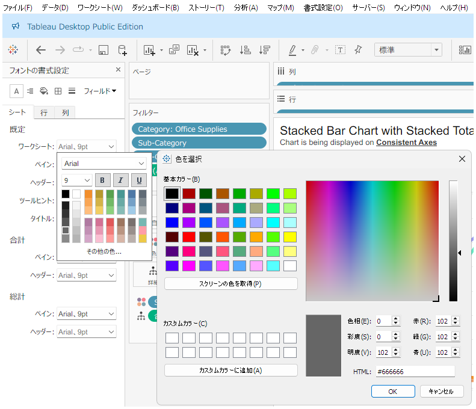
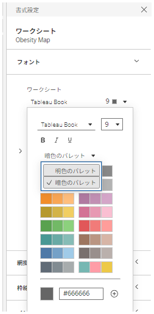
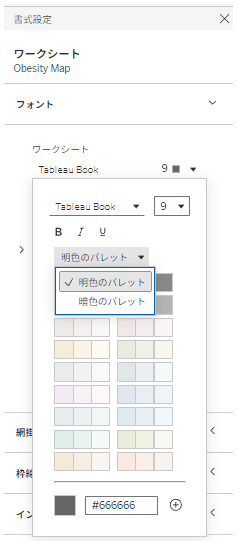

## Feature Differences
The access method to color palette selection options in formatting differs between Tableau Desktop and Tableau Cloud.

- **Desktop**: Limited color palette selection interface with only basic grid options
- **Cloud**: Lighter/darker color palette options are available, expanding the range of color choices

## Usage Instructions
### Tableau Desktop
1. Click the color mark on the worksheet.
2. Select "Edit Colors".
3. A basic color palette grid is displayed.

Desktop example:

### Tableau Cloud
1. Click the color mark on the worksheet.
2. Select "Edit Colors".
3. More extensive lighter/darker color palette options are available.

Cloud examples:

## Usage Examples
- **Visualization Enhancement**: Light/dark tone variations reduce the need for color adjustments using each OS's built-in color picker

## Considerations
- Desktop is limited to traditional basic color palette selection functionality
- Cloud offers improved color selection flexibility with more detailed color adjustments possible
- This feature is classified as available only in Tableau Cloud

## Reference
- [GitHub Issue #95](https://github.com/mickitty0511/tableau-feature-parity/issues/95)