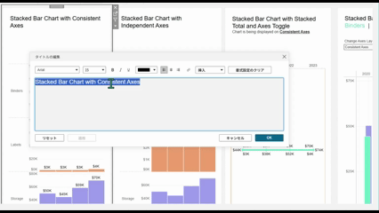
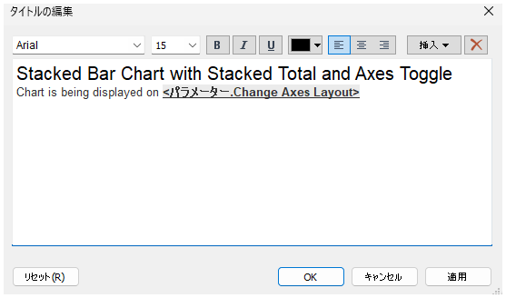

## Feature Differences
This feature is only available in Tableau Cloud. Tableau Cloud allows adding/changing hyperlinks in text editing mode and customizing display names.

- **Desktop**: Limited text editing features only; hyperlink editing functionality is not available
- **Cloud**: Comprehensive hyperlink editing functionality available in text editing mode, with URL configuration and individual display name customization

## Usage Instructions
### For Tableau Cloud
You can manage hyperlinks in text objects or text marks.

#### Adding Hyperlinks
1. Double-click a text object on a dashboard or worksheet to enter text editing mode
2. Select the text you want to hyperlink
3. Click the hyperlink button in the text editing toolbar
4. In the "Insert Hyperlink" dialog, configure the following:
   - **URL**: Web address of the destination
   - **Display Text**: Text shown to users (can be set to a different name than the URL)
5. Click "OK" to apply the settings

#### Changing Hyperlinks
1. Select existing hyperlink text
2. Click the hyperlink button in the text editing toolbar
3. Modify the URL or display text in the "Edit Hyperlink" dialog
4. Save the changes

#### Customizing Display Names
1. Hyperlink display text can be customized independently from the actual URL string
2. Example: While the URL is "https://www.example.com/very-long-complex-url", the display text can be set as "Sample Site"
3. This provides user-friendly text display while maintaining proper link functionality

Cloud example:

### For Tableau Desktop
This advanced hyperlink editing functionality is not available in Tableau Desktop.

Desktop example:

## Use Cases
### Specific Applications
- **Dashboard Navigation**: Direct links to related reports or websites
- **Reference Information**: External links to data sources or detailed explanations

---
Reference: [GitHub Issue #13](https://github.com/mickitty0511/tableau-feature-parity/issues/13)