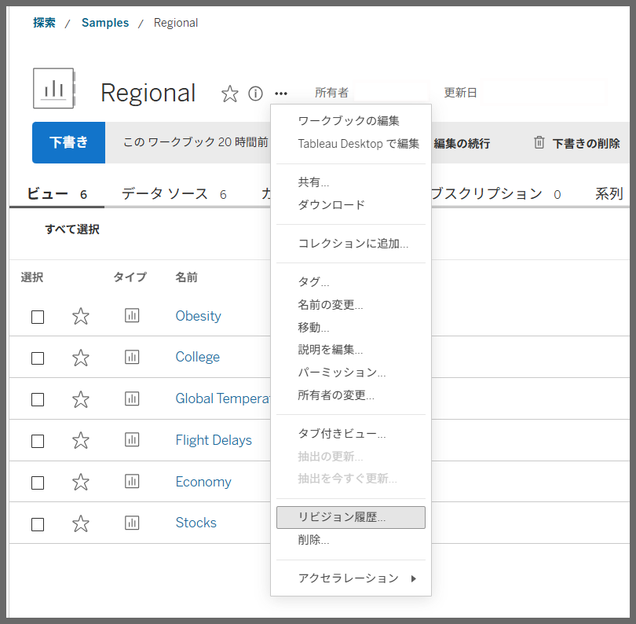
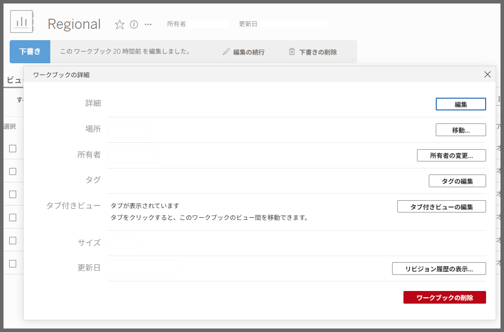

# 高度なワークブック制御コマンド

## 機能差異
Tableau DesktopとTableau Cloudでは、ワークブックの高度な制御コマンドの利用可能性が異なります。

- **Desktop**: 高度なワークブック制御コマンドは利用できません
- **Cloud**: 以下のような高度なワークブック制御コマンドが利用可能です：
  - コレクションに追加
  - 移動
  - 説明の編集
  - パーミッション
  - 所有者の変更
  - リビジョン履歴
  - 詳細の編集
  - 場所の移動
  - リビジョン履歴の表示

## 利用手順

### Tableau Cloudでの操作
1. Tableau Cloudにログインし、ワークブックを選択します。
2. ワークブック上で右クリックまたはオプションメニューを開きます。
3. 利用可能な高度な制御コマンドから必要な操作を選択します。

### Tableau Desktopでの操作
Tableau Desktopでは、これらの高度なワークブック管理機能は利用できません。基本的なファイル操作（保存、名前を付けて保存など）のみが可能です。

## 利用例・用途

### コレクション管理
- ワークブックを特定のコレクションに整理
- チーム間での共有やアクセス管理

### 権限管理
- ワークブックの閲覧・編集権限の詳細設定
- 部門やプロジェクト単位でのアクセス制御

### バージョン管理
- リビジョン履歴の確認と管理
- 以前のバージョンとの比較や復元

### メタデータ管理
- ワークブックの説明やタグの編集
- 検索性向上のための詳細情報管理

## 注意事項・制約

- これらの機能はTableau Cloud専用であり、Tableau Desktopでは利用できません
- 高度なワークブック管理機能により、メタデータ、パーミッション、組織機能の強化された制御が可能です
- 一部の操作には適切な権限が必要な場合があります
- 組織のポリシーに従って機能の利用を検討してください

## 参考
[GitHub Issue #93](https://github.com/mickitty0511/tableau-feature-parity/issues/93)