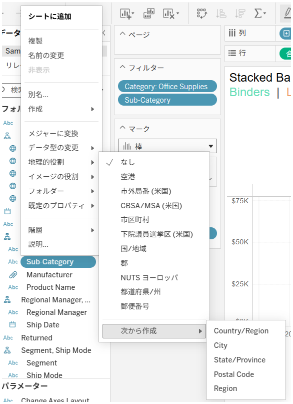
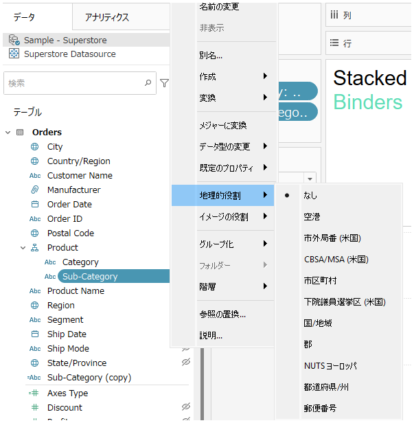

## 機能の違い
この機能はTableau Cloudでのみ利用可能です。Tableau Cloudでは、地理的役割が事前に割り当てられていない文字列フィールドに対しても「作成元」オプションを使用して地理的データを作成することができます。

- **Desktop**: 地理的ロールが割り当てられていない文字列フィールドには、地理的役割から「次から作成」オプションが表示されません。
- **Cloud**: 文字列フィールドに地理的ロールが割り当てられていなくても、地理的役割から「次から作成」オプションが利用できます。

## 使い方
### Tableau Cloudの場合
1. データペーンで地理的な情報を含む文字列フィールドを右クリックします。
2. コンテキストメニューから「地理的役割」 > 「次から選択」を選択します。
3. 既存のフィールド（国、都道府県、市区町村など）から適切なものを選択します。

クラウド版の例：

### Tableau Desktopの場合
Tableau Desktopでは、この機能は制限されています。地理的ロールが事前に割り当てられていない文字列フィールドには「作成元」オプションが表示されません。

1. 文字列フィールドを右クリックしても、「地理的役割」から「次から作成」オプションは表示されません。

デスクトップ版の例：

## 備考
- この機能により、Tableau Cloudでは地理的データの活用がより迅速かつ直感的に行えます。
- Desktop版では、地理的役割の事前設定が必要なため、データ準備により多くの時間が必要です。
- Cloudの自動認識機能により、様々な形式の地理的データに対応できます。

---
参考: [GitHub Issue #17](https://github.com/mickitty0511/tableau-feature-parity/issues/17)