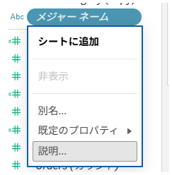
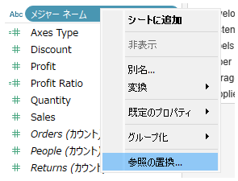

## 機能の違い
この機能はTableau Cloudでのみ利用可能です。Tableau Cloudでは、メジャーネーム（Measure Names）のコンテキストメニューに各メジャーの説明（Description）が表示されます。

- **Desktop**: メジャーネームのコンテキストメニューには説明が表示されません。
- **Cloud**: メジャーネームのコンテキストメニューで各メジャーの説明を確認できます。

## 使い方
### Tableau Cloudの場合
メジャーネームのコンテキストメニューから各メジャーの説明を確認できます：

#### メジャーネームの説明表示手順
1. データペーンまたはシェルフ上の「メジャーネーム」フィールドを右クリックします。
2. コンテキストメニューが表示されます。
3. メニュー内に各メジャーフィールドの説明（Description）が表示されます。
4. 説明を確認することで、そのメジャーが何を表しているかを理解できます。

クラウド版のメジャーネーム説明表示：

### Tableau Desktopの場合
Tableau Desktopでは、メジャーネームのコンテキストメニューに説明は表示されません。

デスクトップ版のメジャーネーム（説明表示なし）：

## 備考
- この機能により、Tableau Cloudではメジャーネームを使用する際のデータ理解が大幅に改善されます。
- 説明が表示されるのは、データソース作成時またはメジャーフィールドの編集時に説明が設定されている場合のみです。
- メジャーバリューと組み合わせたピボット表やマルチメジャーチャートの作成時に特に有効です。
- Desktop版では個別のメジャーフィールドの説明は確認できますが、メジャーネームのコンテキストメニューでは表示されません。

---
参考: [GitHub Issue #15](https://github.com/mickitty0511/tableau-feature-parity/issues/15)