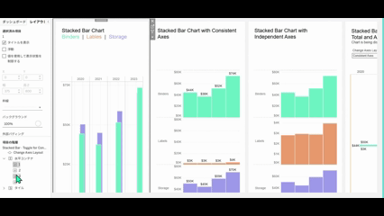
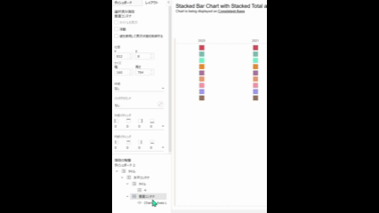

## Feature Differences
This feature is only available in Tableau Cloud. Tableau Cloud allows direct drag and drop repositioning of items within the dashboard layout hierarchy.

- **Desktop**: Drag and drop functionality for items in the layout hierarchy is not available
- **Cloud**: Items can be freely dragged and dropped for repositioning in the layout hierarchy panel

## Usage Instructions
### For Tableau Cloud
1. Open the dashboard in edit mode
2. Display the dashboard hierarchy in the left layout panel
3. Click to select the item you want to move (worksheet, container, object, etc.)
4. Drag the item to the desired position and drop it in the appropriate location
5. The layout hierarchy is immediately updated and the dashboard layout changes

Cloud example:

### For Tableau Desktop
This functionality is not available in Tableau Desktop. Direct item movement in the layout hierarchy is not supported.

1. Item repositioning in dashboards must be done by dragging and dropping directly on the dashboard
2. The layout hierarchy panel only allows viewing and selecting items
3. Complex layout changes require manual repositioning

Desktop example:

## Use Cases
### Specific Applications
- **Layout structure organization**: Visually organizing item hierarchy in complex dashboards
- **Container management**: Changing worksheet order within horizontal/vertical containers
- **Efficient design adjustments**: Intuitive layout changes through drag and drop

### Recommended Usage Scenarios
- When item organization is needed in large-scale dashboards
- When frequently changing arrangements of multiple worksheets or objects  
- When wanting to design while visually understanding layout hierarchy
- When layout consideration is needed during prototype phase

## Operational Importance
### Impact on Dashboard Design
- **Improved design efficiency**: Intuitive operations enable layout changes
- **Structure visualization**: Design while visually understanding layout hierarchy
- **Enhanced maintainability**: Easy management of complex dashboard structures

### Business Impact
- **Time savings**: Manual repositioning work becomes unnecessary
- **Error reduction**: Visual operations prevent positioning mistakes
- **Improved collaboration**: Easy sharing of layout intentions among team members

## Limitations
### Desktop Version Constraints
- No drag and drop functionality in layout hierarchy
- Item repositioning only through direct operations on dashboard
- Time-consuming maintenance of complex hierarchical structures

### Considerations
- This feature significantly impacts dashboard design efficiency, so dashboard creation in Cloud environment is recommended
- For Desktop version, utilize direct drag and drop on dashboard as alternative
- For complex layouts, Cloud version work is more efficient

## Notes
- This feature makes dashboard design in Tableau Cloud more intuitive and efficient
- Visual management of layout hierarchy is particularly important for large-scale dashboards

---
Reference: [GitHub Issue #12](https://github.com/mickitty0511/tableau-feature-parity/issues/12)