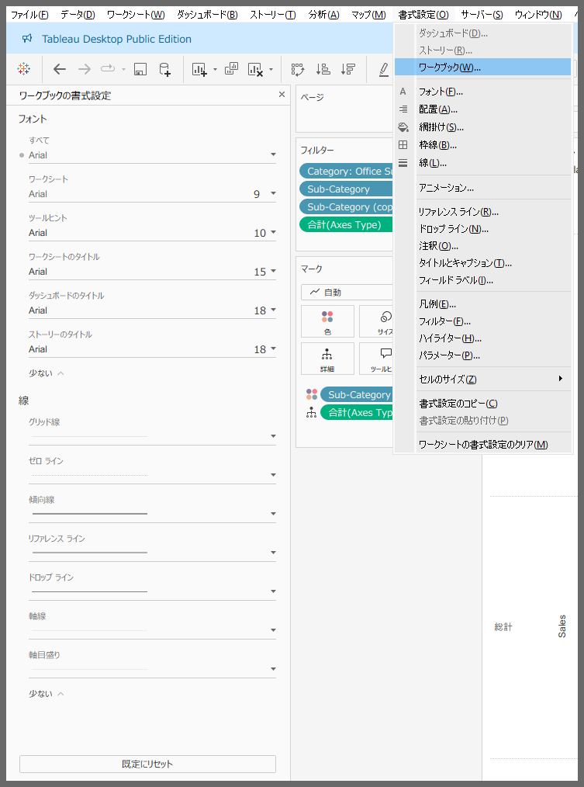
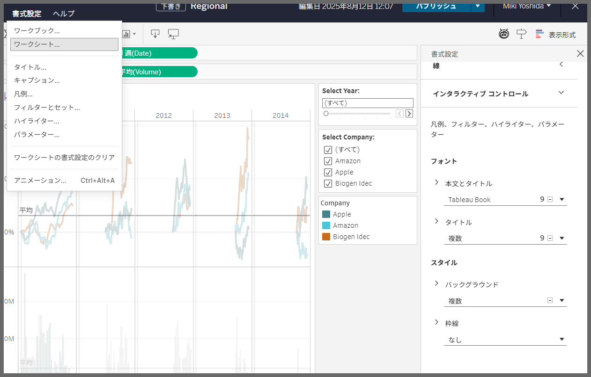

# Edit Interactive Control

## Feature Differences

There are significant differences between Tableau Desktop and Tableau Cloud regarding the editing of interactive control functionality.

- **Desktop**: Interactive control editing functionality is not available
- **Cloud**: Advanced interactive control options are available with detailed editing settings

## Usage Instructions

### Tableau Desktop
Interactive control editing functionality is currently not supported in Tableau Desktop.

### Tableau Cloud  
1. Select an interactive control on a dashboard or worksheet.
2. Access detailed settings from the editing options.
3. Configure advanced interactive control options.

## Usage Examples

### Use Cases in Tableau Cloud
- Improving user interactions in dashboards
- Implementing dynamic filter operations
- Creating custom control elements
- Enhancing usability

## Notes

- **Desktop**: Interactive control editing functionality is currently not provided
- **Cloud**: This functionality is an extension specific to Tableau Cloud
- Future feature additions in Desktop versions are undetermined
- Detailed setting options and limitations in Cloud are planned for future investigation

## Reference

[GitHub Issue #79](https://github.com/mickitty0511/tableau-feature-parity/issues/79)