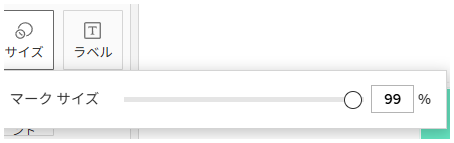
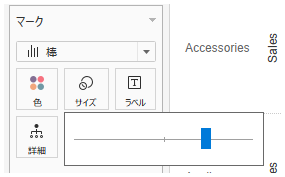

## 機能の違い
この機能はTableau Cloudでのみ利用可能です。Tableau Cloudでは、サイズマークから具体的な数値を直接入力することができます。

- **Desktop**: スライダーを使用してサイズを調整することのみ可能です。
- **Cloud**: フィールドに直接値を入力してサイズを指定することができます。

## 使い方
### Tableau Cloudの場合
1. ワークシートでサイズマークを使用しているビューを作成します。
2. マークカードの「サイズ」ボタンをクリックします。
3. 「マークサイズ」のダイアログで、数値入力フィールドに直接値（例：99%）を入力します。
4. 設定が即座に反映され、正確なサイズが適用されます。

クラウド版の例：

### Tableau Desktopの場合
Tableau Desktopでは、この機能は利用できません。サイズの調整はスライダーのみで行います。

1. マークカードの「サイズ」ボタンをクリックします。
2. スライダーを使用してサイズを調整します。
3. 正確な数値を指定することはできません。

デスクトップ版の例：

## 利用例
### 具体的な用途
- **データ可視化の統一**: 複数のビューで同じサイズ値を適用したい場合
- **正確なレポート作成**: 特定のサイズ要件があるレポートの作成
- **ブランドガイドライン対応**: 企業のビジュアルスタンダードに合わせた正確なサイズ設定

### 推奨される使用場面
- ダッシュボード全体でサイズの一貫性を保ちたい場合
- 複数のワークシートで同じマークサイズを使用したい場合

## 備考
- この機能により、Tableau Cloudではより精密なビジュアル調整が可能になります。
- Desktop版では引き続きスライダーによる直感的な調整のみとなります。
- 数値入力によるサイズ指定は、特にプロフェッショナルなレポート作成において有用です。

---
参考: [GitHub Issue #18](https://github.com/mickitty0511/tableau-feature-parity/issues/18)