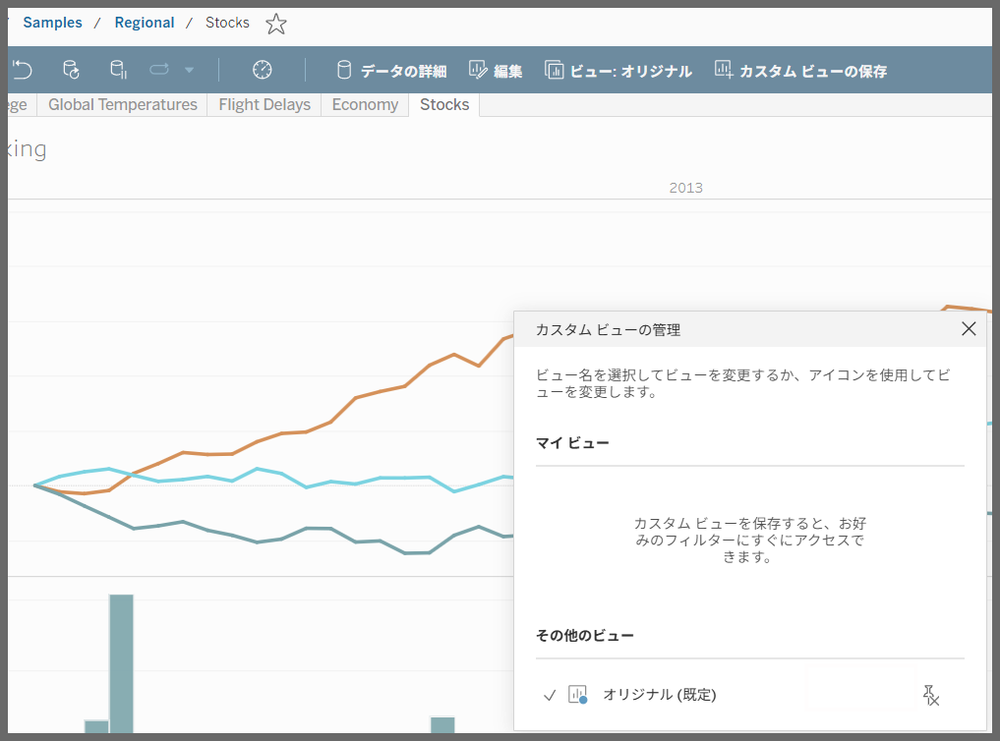
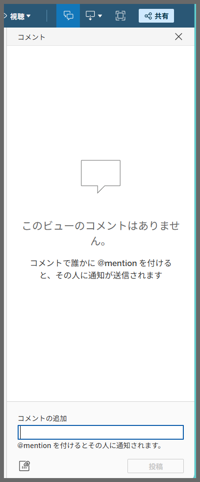
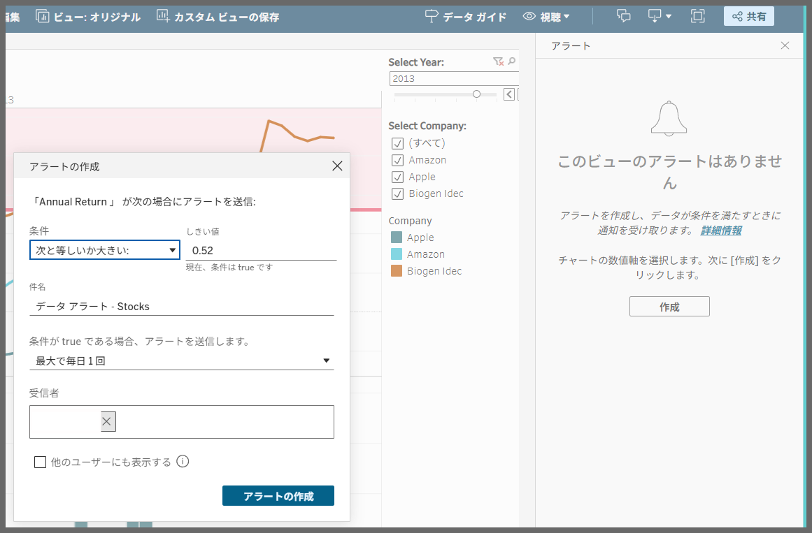
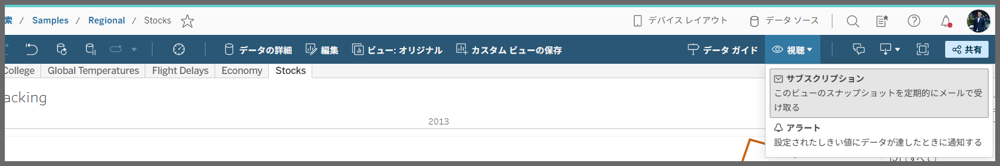
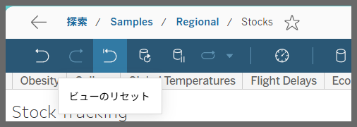
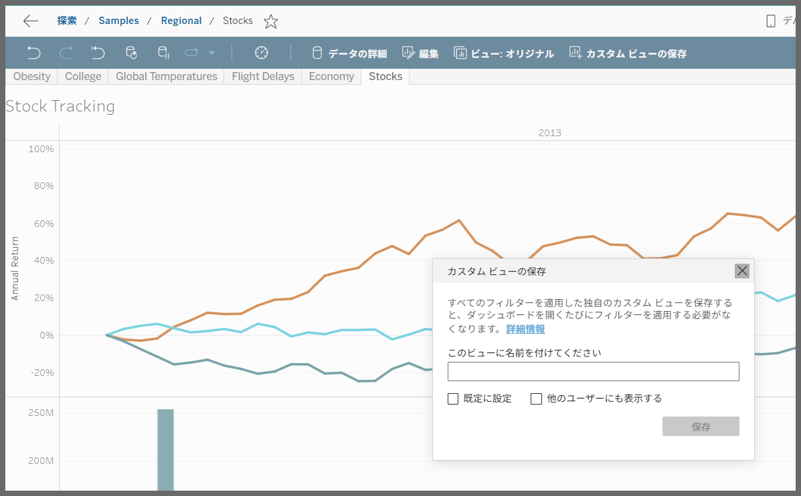
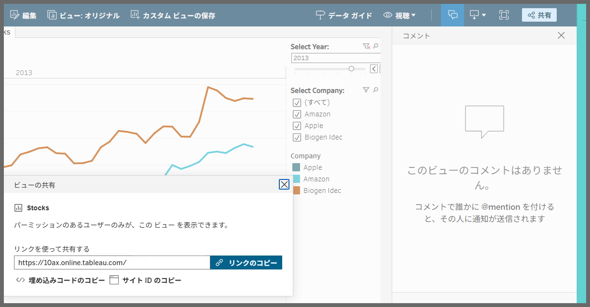
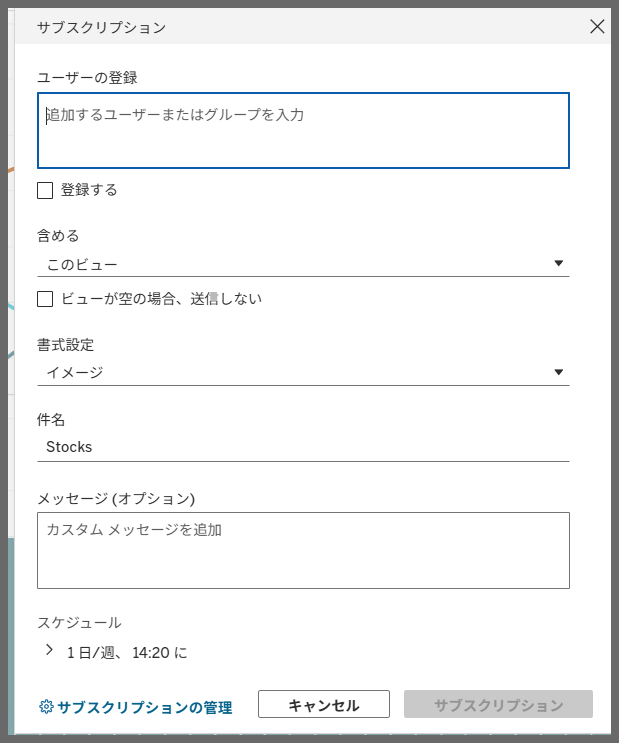

# View Options

## Feature Differences

There are significant differences between Tableau Desktop and Tableau Cloud regarding advanced view management functionality.

- **Desktop**: Only basic view functionality is available; advanced view management features similar to Cloud cannot be accessed
- **Cloud**: Comprehensive view options are available, providing advanced features such as save as, sharing, comments, subscriptions, data-driven alerts, and view reset

## Usage Instructions

### Tableau Desktop
Tableau Desktop provides only basic view functionality and does not have access to the advanced view options available in Cloud.

### Tableau Cloud
Tableau Cloud offers the following advanced view option features:

#### 1. Change View
You can modify view settings and display options.

#### 2. Comment Feature
You can add and manage comments on views.

#### 3. Data-Driven Alert Settings
You can set up automatic alerts based on data changes.

#### 4. Data-Driven Alert Subscription
You can manage alert subscription settings.

#### 5. Reset View
You can reset views to their initial state.

#### 6. Save As
You can save views with new names.

#### 7. Share View
You can share views with other users.

#### 8. Subscription Settings
You can set up periodic updates and notifications for views.

## Usage Examples

### Use Cases in Tableau Cloud
- **Collaboration**: Team discussions using comment functionality
- **Monitoring**: Automatic monitoring of key metrics with data-driven alerts
- **Sharing**: Sharing specific view configurations with other users
- **Backup**: Saving and version management of important view settings
- **Notifications**: Automatic distribution of periodic reports using subscription features

## Notes

- **Desktop**: Advanced view option features available in Cloud are currently not available
- **Cloud**: These features are extensions specific to Tableau Cloud
- Future feature additions in Desktop versions are undetermined
- Detailed setting options and limitations for each feature are planned for future investigation
- Data-driven alerts and subscription features require appropriate permission settings

## Reference

[GitHub Issue #78](https://github.com/mickitty0511/tableau-feature-parity/issues/78)