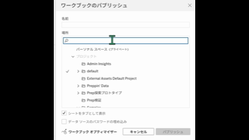
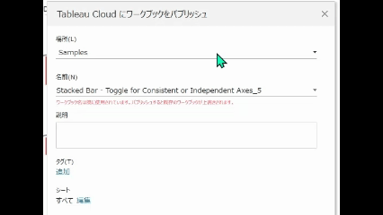

## 機能の違い
この機能はTableau Cloudでのみ利用可能です。Tableau Cloudでは、ワークブックやデータソースをパブリッシュする際にプロジェクト名を検索して選択できます。

- **Desktop**: プロジェクト名の検索機能はありません。プロジェクト一覧から目視で選択する必要があります。
- **Cloud**: プロジェクト名検索機能により、大規模な組織でも目的のプロジェクトを素早く見つけることができます。

## 使い方
### Tableau Cloudの場合
パブリッシュダイアログでプロジェクト名を直接検索できます。

#### プロジェクト検索の手順
1. ワークブックまたはデータソースのパブリッシュを開始します。
2. パブリッシュダイアログの「プロジェクト」フィールドに目的のプロジェクト名の一部を入力します。
3. 入力内容に基づいて、該当するプロジェクト名が候補として表示されます。
4. 表示された候補から適切なプロジェクトを選択します。
5. パブリッシュを完了します。

#### 検索機能の利点
- **高速検索**: 大量のプロジェクトがある環境でも瞬時に目的のプロジェクトを見つけられます。
- **部分一致検索**: プロジェクト名の一部を入力するだけで候補が表示されます。
- **タイプミス防止**: 正確なプロジェクト名を選択できるため、誤ったプロジェクトへのパブリッシュを防げます。

クラウド版の例：

### Tableau Desktopの場合
Tableau Desktopでは、プロジェクト名の検索機能は利用できません。

#### 手動選択の制限
1. プロジェクト一覧をスクロールして目視で目的のプロジェクトを探す必要があります。
2. プロジェクト数が多い場合、該当するプロジェクトを見つけるのに時間がかかります。
3. 似たようなプロジェクト名がある場合、誤選択のリスクが高まります。

デスクトップ版の例：

## 利用例
### 具体的な用途
- **大規模組織**: 数百のプロジェクトが存在する企業環境での効率的なパブリッシュ
- **部門別プロジェクト管理**: 「Sales-2024-Q3」「Marketing-Dashboard」などの命名規則に基づく迅速な検索
- **時間効率化**: パブリッシュ作業の時間短縮と生産性向上
- **誤配布防止**: 正確なプロジェクト選択による運用リスクの軽減

### 推奨される使用場面
- プロジェクトが大量に存在する環境
- 定期的なレポートパブリッシュを行う運用チーム
- 複数の部門や事業単位でTableauを利用している組織
- パブリッシュ頻度が高く、作業効率化が求められる場面

### 運用上の重要性
- **パブリッシュワークフローの効率化**: 日常的なパブリッシュ作業の時間短縮
- **運用ミスの削減**: 間違ったプロジェクトへのパブリッシュ防止
- **スケーラビリティ**: 組織の成長に伴うプロジェクト数増加への対応
- **ユーザビリティ向上**: 直感的な操作による学習コストの削減

## 備考
- この機能により、Tableau Cloudでのパブリッシュ作業が大幅に効率化されます。
- 特に大規模な組織や多数のプロジェクトを管理する環境では必須の機能です。
- Desktop版では、プロジェクトの命名規則を統一し、アルファベット順での整理を推奨します。
- プロジェクト名の検索は部分一致で動作するため、短い単語でも効果的に検索できます。
- この機能は日常的なパブリッシュワークフローの生産性に直接影響するため、運用上極めて重要です。

---
参考: [GitHub Issue #11](https://github.com/mickitty0511/tableau-feature-parity/issues/11)