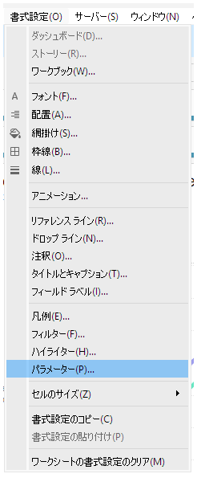
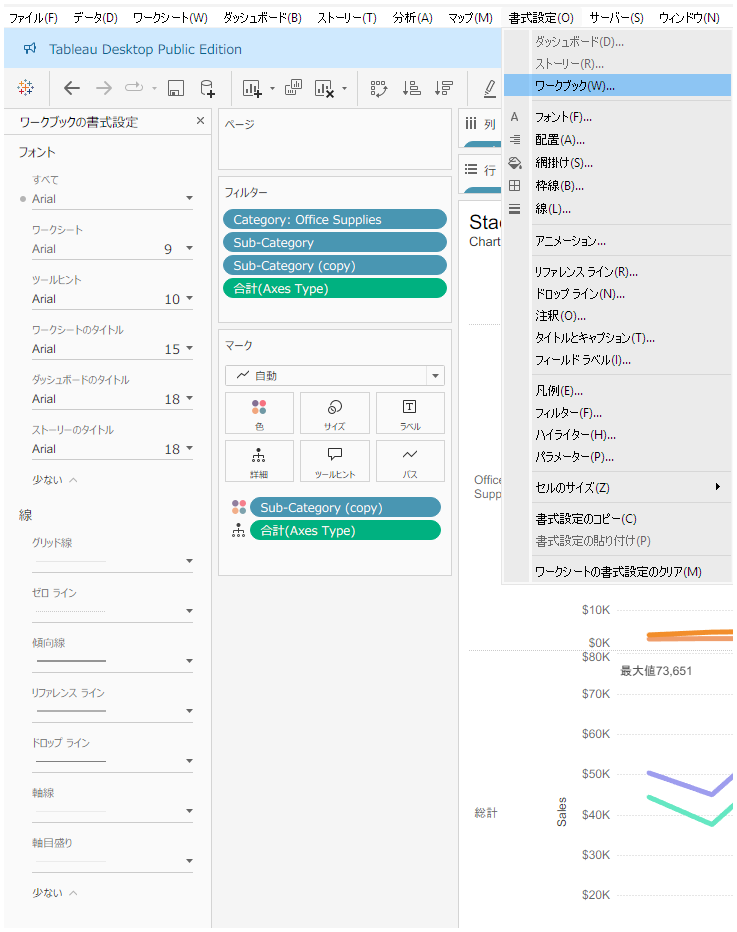
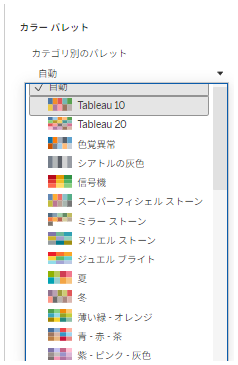
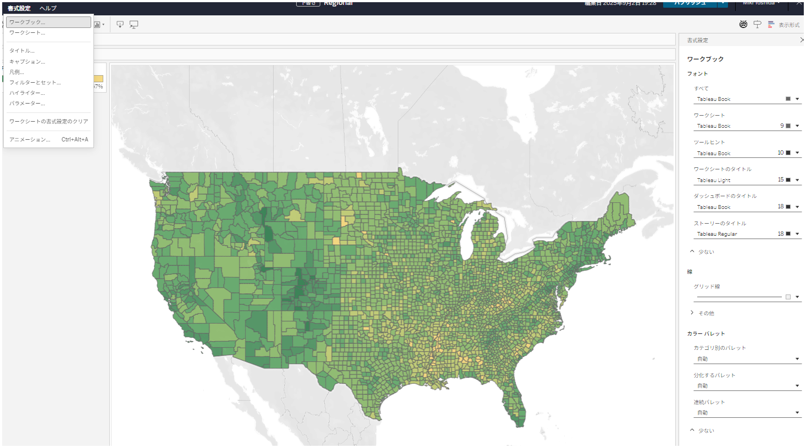

## 機能差異
デフォルトのカラーパレット選択機能は、Tableau DesktopとTableau Cloudで大きく異なります。

- **Desktop**: この機能は利用できません（ただし、ディメンションフィールドの個別の値に対する色設定は、フィールドプロパティの色設定を通して行えます）
- **Cloud**: 3種類すべてのデフォルトカラーパレットタイプ（カテゴリ別、連続、分岐パレット）から選択可能で、包括的な書式設定パネルオプションが利用できます

## 利用方法
### Tableau Desktop
この機能は利用できません。
ただし、ディメンションフィールドのみ各値にそれぞれ色をデフォルトで割り当て可能。
参照: [set_field_default_properties](../../desktop-only/set_field_default_properties/)

デスクトップの例：

### Tableau Cloud
1. 「書式設定」メニューを選択します。
2. 「ワークブック」を選択します。
3. 「カラーパレット」オプションにアクセスできます。
4. 3種類のカラーパレットタイプに対してそれぞれカラーパレットを指定できます。

クラウドの例：

## カラーパレットタイプについて
Tableauでは3種類のカラーパレットタイプが用意されています：

### 1. カテゴリ別パレット（Categorical）
- 順序のない離散データ（製品、地域など）に使用
- 各項目を区別するための異なる色を使用
- 例：Tableau 10、Tableau 20、Color Blind

### 2. 連続パレット（Sequential）
- 連続データ（数値、日付など）に使用
- 明るい色から暗い色へのグラデーションで値の大きさを表現
- 例：オレンジ、ブルー、グレー

### 3. 分岐パレット（Diverging）
- 意味のある中心点（ゼロ、平均値など）を持つデータに使用
- 2つの連続パレットを組み合わせ、中央に中性色を配置
- 例：オレンジ-ブルー分岐、レッド-グリーン分岐

## 使用例・用途
- **データタイプに応じた適切な色選択**: 3種類のパレットタイプから、データの性質に最適なものを選択可能
- **一貫したビジュアルデザイン**: 事前定義されたパレットにより、統一感のある可視化を実現
- **効率的なワークフロー**: ドロップダウンメニューから素早くパレットを選択・適用可能

## 注意事項・考慮点
- Desktopでは個別の値に対する色設定のみが可能で、パレット全体の選択機能はありません
- Cloudでは3種類すべてのパレットタイプからの選択が可能で、より柔軟な色設定ができます
- この機能差により、Cloud環境でより効率的なカラーマネジメントが実現されています

## 参考
- [GitHub Issue #96](https://github.com/mickitty0511/tableau-feature-parity/issues/96)