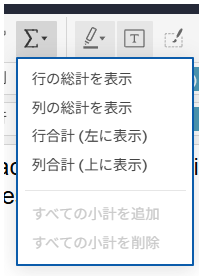
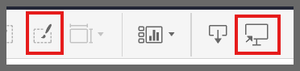
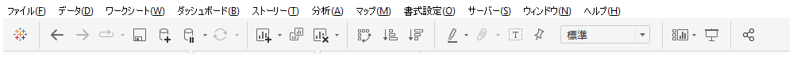

## 機能の違い
この機能はTableau Cloudでのみ利用可能です。Tableau Cloudでは、ツールバーに総計オプション、ワークブック書式設定、ダウンロード機能が直接アクセスできるボタンとして提供されています。

- **Desktop**: これらの機能はメニューの深い階層やコンテキストメニューからアクセスする必要があります。
- **Cloud**: ツールバーから直接アクセスでき、効率的な操作が可能です。

## 使い方
### Tableau Cloudの場合
ツールバーには以下の3つの主要な機能ボタンが配置されています：

#### 1. 総計オプション (Σ ボタン)
1. ワークシートまたはダッシュボードでツールバーの総計ボタン（Σ）をクリックします。
2. ドロップダウンメニューから以下のオプションを選択できます：
   - **行の総計を表示**: 行の総計を表示/非表示
   - **列の総計を表示**: 列の総計を表示/非表示
   - **列合計（左に表示）**: 列合計を左側に配置
   - **列合計（上に表示）**: 列合計を上部に配置
   - **すべての小計を追加**: 全ての小計を一括追加
   - **すべての小計を削除**: 全ての小計を一括削除

クラウド版の総計機能：

#### 2. ワークブック書式設定 (ペンボタン)
1. ツールバーの書式設定ボタン（ペンアイコン）をクリックします。
2. ワークブック全体の書式設定パネルが開きます。
3. フォント、色、レイアウトなどの書式設定を素早く変更できます。

#### 3. ダウンロード機能
1. ツールバーのダウンロードボタンをクリックします。
2. 以下の形式でワークブックやビューをダウンロードできます：
   - PDF形式
   - 画像形式（PNG、JPG）
   - データ形式（CSV、Excel）
   - Tableau形式（TWB、TWBX）

### Tableau Desktopの場合
Tableau Desktopでは、これらの機能はツールバーに専用ボタンとして配置されていません。

1. **総計機能**: 「分析」メニュー → 「総計」から各オプションにアクセス
2. **書式設定**: 「書式設定」メニューまたは右クリックコンテキストメニューからアクセス
3. **エクスポート**: 「ファイル」メニュー → 「エクスポート」から各形式を選択

デスクトップ版のツールバー：

## 利用例
### 総計オプションの活用場面
- **クロス集計表の作成**: 行と列の総計を素早く追加
- **ダッシュボードでの集計表示**: 総計の表示位置を調整
- **レポート作成**: 小計の一括追加/削除で見やすいレポートを作成

### ワークブック書式設定の活用場面
- **ブランドカラーの適用**: 企業カラーを素早く全体に適用
- **フォント統一**: ワークブック全体のフォントを統一
- **レイアウト調整**: 全体的なデザイン調整を効率的に実行

### ダウンロード機能の活用場面
- **プレゼンテーション資料作成**: PDF形式でプレゼン用にエクスポート
- **データ共有**: CSV形式でデータを他のツールと共有
- **バックアップ作成**: TWBX形式でワークブックを保存

## 備考
- これらのツールバー機能により、Tableau Cloudではより効率的な作業フローが実現できます。
- Desktop版でも同等の機能は利用できますが、メニューの深い階層からアクセスする必要があります。
- 特に総計オプションのドロップダウンメニューは、クロス集計表の作成時に非常に便利です。
- ワークブック書式設定ボタンは、複数のワークシートに一貫した書式を適用する際に効果的です。

---
参考: [GitHub Issue #16](https://github.com/mickitty0511/tableau-feature-parity/issues/16)