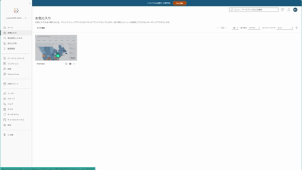
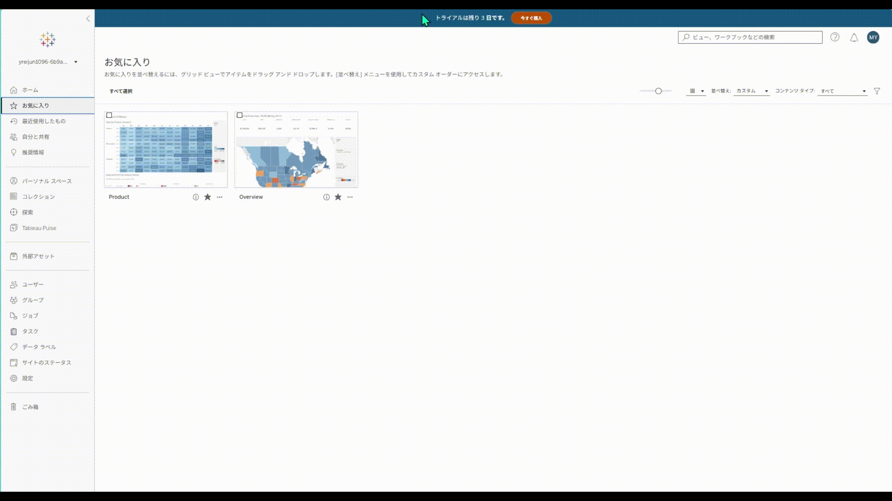

## 機能の違い
この機能はTableau Cloudでのみ利用可能です。Tableau Cloudでは、ワークシート名を変更してもビューのURLが変わらず、安定したリンクを維持できます。

- **Desktop**: ワークシート名を変更すると、ビューのURLも変更される可能性があります。
- **Cloud**: ワークシート名を変更しても、ビューのURLは変わりません。一度生成されたURLは恒久的に使用できます。

## 使い方
### Tableau Cloudの場合
ワークシート名を変更しても、既存のブックマークや共有リンクが引き続き機能します。

#### URL安定性の動作
1. ワークシートが最初に作成されたとき、一意のビューURLが生成されます。
2. ワークシート名を変更しても、このURLは変わりません。
3. 既存のブックマーク、埋め込みリンク、共有URLはすべて有効に保たれます。
4. URLの安定性により、外部システムとの統合や継続的なリンク管理が容易になります。

クラウド版の例：

### Tableau Desktopの場合
Tableau Desktopでは、ワークシート名の変更がURLに影響を与える可能性があります。

#### URL変更
1. ワークシート名を変更すると、公開時のビューURLが変更される場合があります。
2. 既存のブックマークやお気に入りが無効になる可能性があります。
3. 外部システムからの参照が切れる場合があります。
4. Tableau Desktopではシート名の変更控える必要があります・

デスクトップ版の例：

## 備考
- この機能により、Tableau Cloudでのワークシート管理とリンク共有がより効率的になります。
- Desktop版では、ワークシート名変更時のURL影響を事前に確認し、必要に応じてリンクを更新する運用が重要です。
- URL安定性は、特に本番環境や外部システム統合において業務継続性の観点から重要な機能です。
- 長期的なダッシュボード運用において、ワークシート名の変更は避けられない場合が多いため、Tableau Cloudでシート名を変更が効率的です。

---
参考: [GitHub Issue #10](https://github.com/mickitty0511/tableau-feature-parity/issues/10)