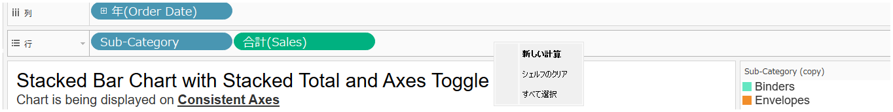
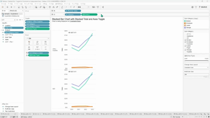
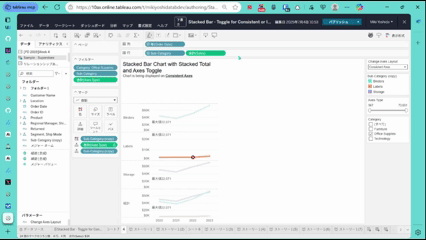

## Feature Differences
Context menus in blank areas of shelves are only available in Tableau Desktop.

- **Desktop**: You can access convenient options such as "Clear Shelf," "New Calculated Field," and "New Parameter" by right-clicking on blank areas of shelves.
- **Cloud**: Right-clicking on blank areas of shelves does not display context menus.

## Usage Instructions
### Tableau Desktop
1. Open a worksheet in Tableau Desktop.
2. Right-click on blank areas of shelves (columns, rows, filters, pages, marks, etc.).
3. Select from the following operations in the displayed context menu:
   - Clear Shelf
   - New Calculated Field
   - New Parameter
   - Other convenient options

### Tableau Cloud Limitations
- Right-clicking on blank areas of shelves does not display context menus.
- To perform similar operations, you need to use other methods (such as drag & drop from the data pane).

## Use Cases
- **Clear Shelf**: When you want to reset worksheets by clearing the contents of multiple shelves at once
- **Create Calculated Fields**: When you want to quickly create new calculated fields during analysis
- **Create Parameters**: When you want to quickly add parameters while creating interactive dashboards
- **Workflow Efficiency**: Work efficiency improves as you can access multiple options with a single right-click

## Screenshots
### Tableau Desktop
Context menu options for blank areas of shelves:

Shelf context menu demo:

### Tableau Cloud

## Notes and Considerations
- This feature is only available in Tableau Desktop and is not provided in Tableau Cloud.
- Cloud users need to access calculated field and parameter creation directly from the data pane or menu bar.
- This feature difference may change user workflows when migrating from Desktop to Cloud.
- Whether such context menus will be supported in Cloud in the future is undetermined.

---
Reference: [GitHub Issue #69](https://github.com/mickitty0511/tableau-feature-parity/issues/69)