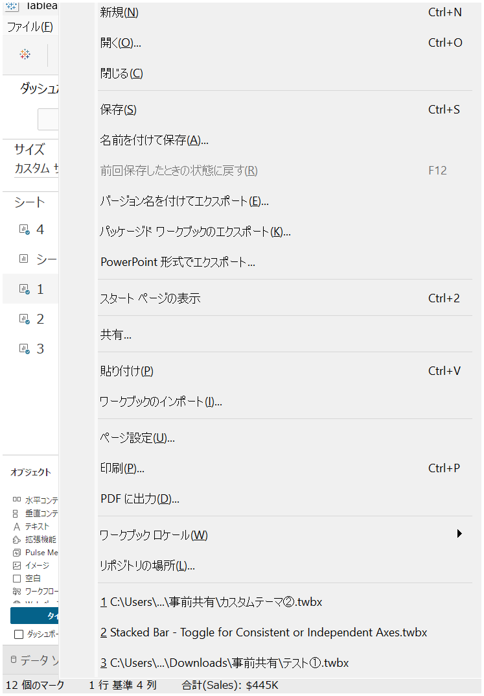
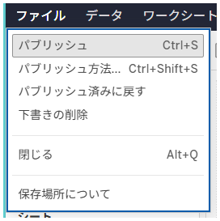

## 機能の違い
エクスポート時にワークブックファイルにバージョン名を追加する機能は、Tableau Desktopでのみ利用可能です。

- **Desktop**: ワークブックをエクスポートする際に、ファイル名にバージョン名を追加できます。
- **Cloud**: エクスポート時にバージョン名を追加する機能はありません。

## 使用方法
### Tableau Desktop
1. ワークブックを開きます。
2. メニューから「サーバー」>「ワークブックの公開」または「ファイル」>「エクスポート」を選択します。
3. エクスポートダイアログでバージョン名を追加するオプションが表示されます。
4. 必要に応じてバージョン名を入力し、エクスポートを実行します。

### Tableau Cloud
1. ワークブックを開きます。
2. 保存やエクスポートのオプションにアクセスします。
3. バージョン名を追加する機能は利用できません。

## 使用例・ユースケース
- **バージョン管理**: ワークブックの異なるバージョンを区別して管理したい場合
- **リリース管理**: 本番環境用、テスト環境用など、用途別にファイルを管理したい場合
- **アーカイブ**: 特定の時点でのワークブックの状態を記録したい場合

## 注意事項・考慮点
- この機能はTableau Desktopでのみ利用可能で、Tableau Cloudでは現在サポートされていません。
- バージョン名を追加することで、ファイル管理がより効率的になります。
- Cloudでワークブックを管理する場合は、プロジェクト名やタグを活用してバージョン管理を行う必要があります。

---
参考: [GitHub Issue #54](https://github.com/mickitty0511/tableau-feature-parity/issues/54)