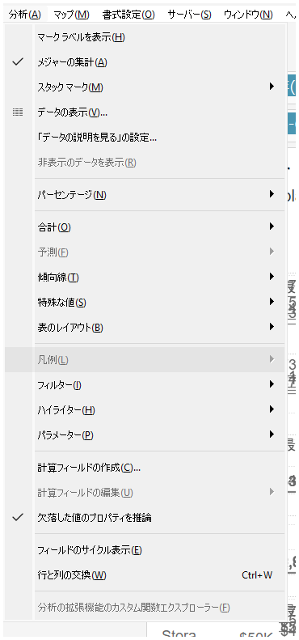
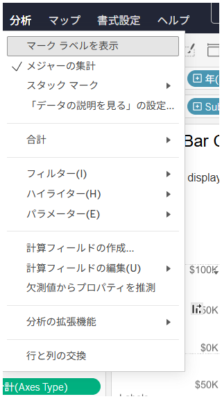

## 機能の違い
Analytics の cycle fields 機能は、Tableau Desktop でのみ利用可能です。

- **Desktop**: Analytics ペインから cycle fields 機能を使用できます。
- **Cloud**: この機能は利用できません。

## 使用方法
### Tableau Desktop の場合
1. ワークシートビューで Analytics ペインを開きます。
2. Analytics ペインから cycle fields オプションを確認できます。
3. この機能を使用してフィールドを循環させることができます。

Desktop での例:

### Tableau Cloud の場合
1. ワークシートビューで Analytics ペインを開きます。
2. Cloud では cycle fields オプションは表示されません。

Cloud での例:

## 使用例・ユースケース
- Desktop では Analytics の cycle fields 機能を使用して、データの分析における フィールドの循環表示が可能です。
- この機能により、複数のフィールド間での切り替えや比較分析が効率的に行えます。

## 注意事項・制限事項
- この機能は現在 Tableau Desktop でのみ利用可能です。
- Tableau Cloud では同等の機能は提供されていません。
- 将来的な Cloud での対応については、Tableau の公式アップデート情報をご確認ください。

---
参考: [GitHub Issue #52](https://github.com/mickitty0511/tableau-feature-parity/issues/52)