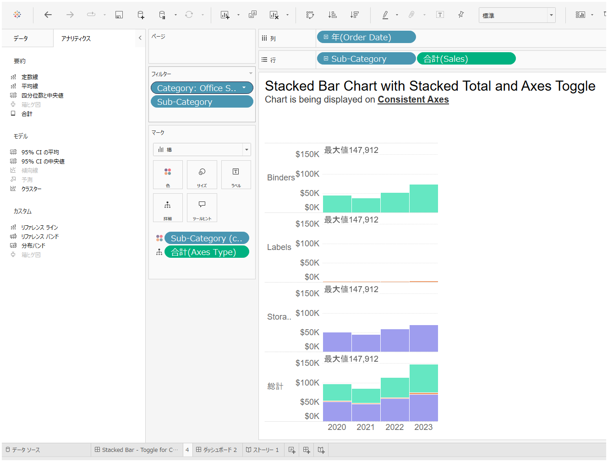
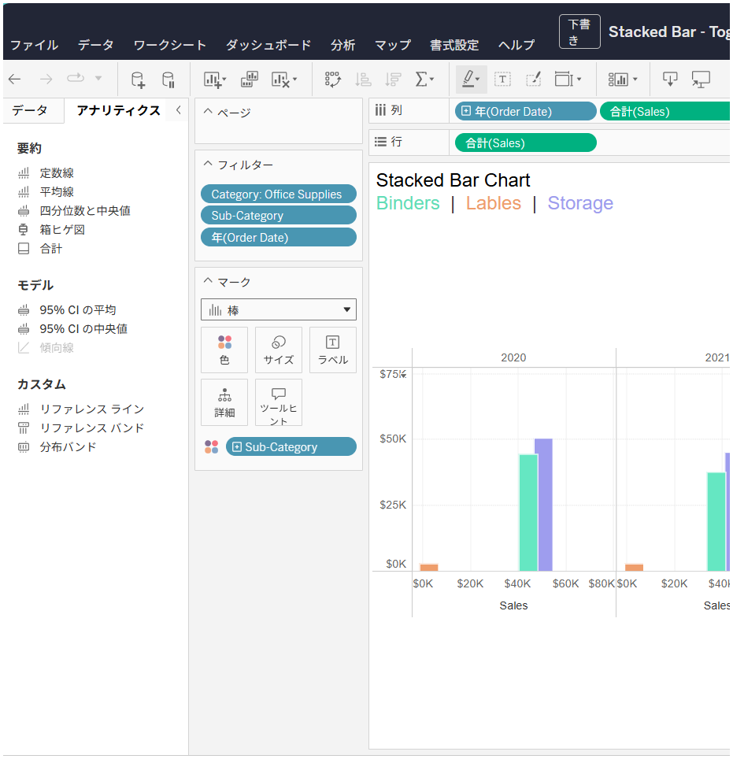

## 機能の違い
予測、クラスタリング、ボックスプロットなどの高度な分析機能は、Tableau Desktopでのみ利用可能です。

- **Desktop**: アナリティクスタブで予測、クラスタリング、ボックスプロット、トレンドライン、参照線などの高度な分析機能が使用できます。
- **Cloud**: 基本的な参照線や集計機能のみが利用でき、予測やクラスタリングなどの高度な機能は利用できません。

## 使用方法
### Tableau Desktop
1. ワークシートを開き、左側のペインで「アナリティクス」タブを選択します。
2. モデルセクションから以下の高度な分析機能が利用できます：
   - **予測**: 時系列データの将来の値を予測
   - **クラスタリング**: データポイントを類似性に基づいてグループ化
   - **ボックスプロット**: データの分布と外れ値を視覚化
3. 使用したい分析機能をビューにドラッグアンドドロップして適用します。

### Tableau Cloud
1. ワークシートを開き、左側のペインで「アナリティクス」タブを選択します。
2. 利用可能な機能は以下の基本的なものに限定されます：
   - 参照線
   - 参照バンド
   - 分布バンド
   - ボックスプロット（制限あり）

## 使用例・ユースケース
### 予測機能の活用
- 売上データの将来トレンド予測
- 季節性を考慮した需要予測
- KPIの将来値の推定

### クラスタリング機能の活用
- 顧客セグメンテーション
- 商品の類似性分析
- 地域別の特性分析

### ボックスプロット機能の活用
- データの分布状況の把握
- 外れ値の特定
- グループ間の比較分析

## 注意事項・考慮点
- Tableau Cloudでは、高度な統計分析機能が制限されているため、複雑な分析作業はDesktopで行う必要があります。
- Desktopで作成した予測やクラスタリングを含むワークブックをCloudで表示することは可能ですが、編集や新規作成はできません。
- 組織の分析ニーズに応じて、DesktopとCloudの使い分けを検討することが重要です。
- 将来的にはCloudでも高度な分析機能が追加される可能性がありますが、現時点では機能制限があります。

---
参考: [GitHub Issue #50](https://github.com/mickitty0511/tableau-feature-parity/issues/50)