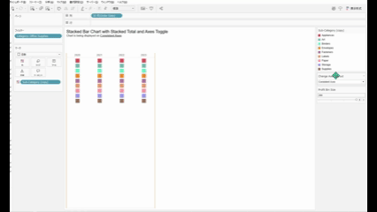
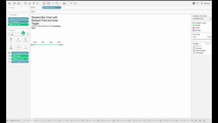

## 機能の違い

ワークシート編集画面でのシェルフ、パラメーター、凡例の配置変更は、Tableau Desktopでのみ利用可能です。

- **Desktop**: シェルフ、パラメーター、凡例をドラッグ&ドロップで自由に配置変更できます
- **Cloud**: レイアウトは固定されており、配置を変更することはできません

## 使用方法

### Tableau Desktop
1. ワークシート編集画面を開きます
2. シェルフ、パラメーター、または凡例をクリックしてドラッグします
3. 希望する位置にドロップして配置を変更します

### Tableau Cloud
1. ワークシート編集画面を開きます
2. レイアウトは固定されており、ドラッグ&ドロップによる配置変更はできません

## 使用例・活用方法

- **ワークスペースの最適化**: よく使用するシェルフを手の届きやすい位置に配置
- **カスタムレイアウト**: プロジェクトや作業スタイルに応じてレイアウトを調整
- **効率的な作業**: 頻繁に使用する要素を近くに配置して作業効率を向上

## 注意点・制限事項

- この機能はTableau Desktopでのみ利用可能です
- Tableau Cloudでは、レイアウトが固定されており配置変更はできません
- 配置変更はワークブック内で保存され、次回開く際にも反映されます
- 一部のシェルフやパネルは配置変更できない場合があります

---
参考: [GitHub Issue #62](https://github.com/mickitty0511/tableau-feature-parity/issues/62)