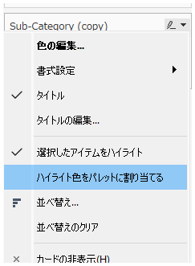
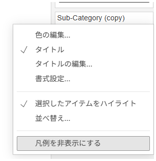

## Feature Differences
The option to assign highlight colors to palettes when enabling "Highlight Selected Items" from legends is only available in Tableau Desktop.

- **Desktop**: The legend context menu includes the "Assign Highlight Color to Palette" option, allowing more detailed control over color management when using highlight features.
- **Cloud**: This option is not available. Only basic highlight features are available.

## Usage Instructions
### Tableau Desktop
1. Right-click on a legend in the worksheet.
2. Select "Highlight Selected Items" from the context menu.
3. Select the "Assign Highlight Color to Palette" option to customize the colors used for highlighting.

Desktop example:

### Tableau Cloud
1. Right-click on a legend in the worksheet.
2. You can select "Highlight Selected Items" from the context menu, but detailed highlight color setting options are not available.

Cloud example:

## Use Cases and Applications
- **Visual Data Emphasis**: When you want to maintain color consistency while highlighting specific categories or data points
- **Dashboard Consistency**: When you want to use the same highlight colors across multiple views to maintain unified visual design
- **Presentations**: For controlling colors when you want the audience to focus on specific data

## Notes and Considerations
- In Desktop, assigning highlight colors to palettes enables more detailed color control.
- In Cloud, only standard highlight features are available with limited color customization.
- This feature is labeled as "operationally-critical" and may have significant impact on workbook editing functionality.
- This feature may become available in Cloud in the future.

---
Reference: [GitHub Issue #49](https://github.com/mickitty0511/tableau-feature-parity/issues/49)