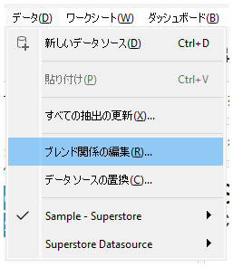
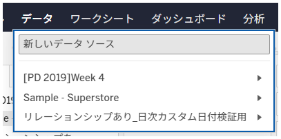

## 機能の違い
ブレンド設定オプションは、Tableau Desktopでのみ利用可能です。

- **Desktop**: データブレンドの詳細設定を行うためのブレンド設定オプションが利用できます
- **Cloud**: ブレンド設定オプションは利用できません

## 使用方法
### Tableau Desktop
1. データソースを複数接続してデータブレンドを行います
2. データメニューまたはリレーションシップの編集画面でブレンド設定にアクセスします
3. ブレンド設定オプションを使用して、高度なデータブレンドの設定を行います

Desktopでの例:

### Tableau Cloud
1. データブレンドは基本的な機能のみ利用可能です
2. ブレンド設定オプションは表示されません

Cloudでの例:

## 使用例・ユースケース
- 複数のデータソースを組み合わせて分析を行う場合
- データソース間の結合方法を細かく制御したい場合
- 高度なデータブレンド機能を活用した複雑なダッシュボード作成

## 注意点・考慮事項
- Desktopでは詳細なブレンド設定により、より柔軟なデータ結合が可能です
- Cloudでは基本的なブレンド機能のみサポートされており、高度な設定は利用できません
- 運用上重要な機能のため、Desktopでの作業が必要な場合があります
- 将来的にCloudでの対応が予定されているかは未確認です

---
参考: [GitHub Issue #47](https://github.com/mickitty0511/tableau-feature-parity/issues/47)