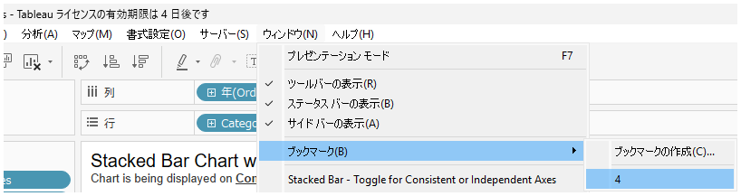

## 機能の差異
重要なワークシートをブックマークする機能は、Tableau Desktopでのみ利用可能です。

- **Desktop**: ワークシートをブックマークして素早くアクセスすることができます
- **Cloud**: ブックマーク機能は利用できません

## 使用方法
### Tableau Desktop
1. ブックマークしたいワークシートを開きます
2. メニューバーから**ウィンドウ(W)**を選択します
3. **ブックマーク(B)**オプションを選択します
4. ブックマークされたワークシートは後で素早くアクセスできるようになります

Desktop例：

### Tableau Cloud
Tableau Cloudではブックマーク機能は提供されていません。

## 利用例・使用ケース
- 頻繁に参照する重要なワークシートへの素早いアクセス
- 複数のワークシートを含む大きなワークブックでの効率的なナビゲーション
- 作業中によく使用するワークシートの管理

## 注意事項・考慮事項
- この機能はTableau Desktopでのみ利用可能です
- ブックマークはローカルの設定として保存されます
- ワークブックを他のユーザーと共有する際、ブックマーク情報は共有されません

---
参考: [GitHub Issue #55](https://github.com/mickitty0511/tableau-feature-parity/issues/55)