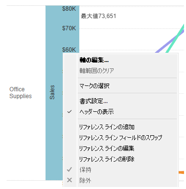
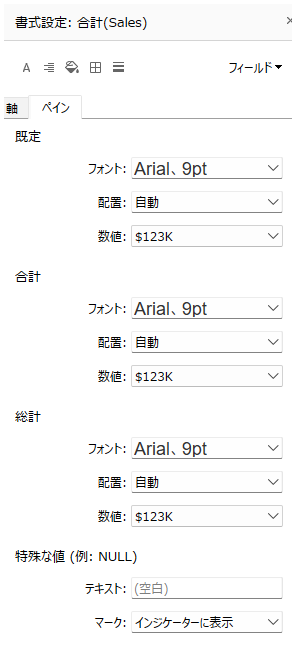

## 機能差異
書式設定から合計・総合計のラベルを変更する機能は、Tableau Desktop でのみ利用可能です。

- **Desktop**: 軸の書式設定ダイアログから合計・総合計のラベルテキストをカスタマイズできます
- **Cloud**: 基本的な書式設定メニューのみ利用可能で、合計・総合計のラベル変更オプションは提供されていません

## 使用手順
### Tableau Desktop での操作
1. ビュー内の軸を右クリックし、コンテキストメニューから「軸の編集...」を選択します

2. 軸の編集ダイアログが開き、合計・総合計の詳細な書式設定オプションにアクセスできます

3. 以下の項目をカスタマイズできます：
   - **軸**: フォント、配置、数値形式の設定
   - **合計**: フォント、配置、数値形式の設定
   - **総計**: フォント、配置、数値形式の設定
   - **特殊な値**: NULL値の表示テキストとマークの設定

### Tableau Cloud での制限
1. 軸を右クリックしても、基本的な書式設定メニューのみ表示されます

2. 合計・総合計の詳細なカスタマイズオプションは利用できません

## 使用例・活用場面
- **レポートの見栄え向上**: 合計行のフォントサイズを大きくして強調表示
- **多言語対応**: 「合計」「総計」のラベルを他の言語に変更
- **ブランディング**: 企業の書式ガイドラインに合わせたフォント設定
- **数値形式の統一**: 合計行のみ異なる数値形式（例：K単位表示）を適用

## 注意事項・考慮点
- **Desktop 限定機能**: この詳細な書式設定機能は現在 Desktop でのみ利用可能です
- **パブリッシュ時の保持**: Desktop で設定した書式は Cloud にパブリッシュ後も保持されます
- **編集制限**: Cloud では一度パブリッシュされた後、これらの詳細設定を変更することはできません
- **運用への影響**: 合計・総合計の表示形式が重要なレポートでは、Desktop での事前設定が必須となります

## 補足
この機能は業務上重要度の高い（operationally-critical）機能として分類されており、ワークブック編集機能に大きく影響する可能性があります。レポートの完成度や見た目の統一性において重要な役割を果たします。

---
参考: [GitHub Issue #46](https://github.com/mickitty0511/tableau-feature-parity/issues/46)