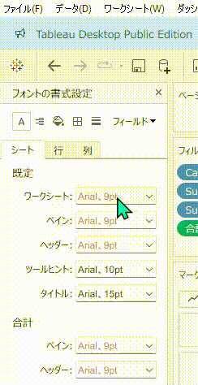

# フォーマットペイン個別書式設定のクリア

## 機能差異
Tableau DesktopとTableau Cloudでは、フォーマットペインでの個別書式設定クリア機能の利用可能性が異なります。

- **Desktop**: フォーマットペインで個別の書式設定（太字で表示）を右クリックし、「クリア」を選択して特定の設定のみをデフォルトにリセットできます
- **Cloud**: フォーマットペインでの個別書式設定の右クリッククリア機能は利用できません

## 利用手順

### Tableau Desktopでの操作
1. ビジュアライゼーション要素を右クリックし、「書式設定...」を選択してフォーマットペインを開きます。
2. フォーマットペイン内で**太字で表示されているラベル**を確認します（デフォルトから変更された設定）。
3. リセットしたい特定の設定の太字ラベルを右クリックします。
4. 表示されるコンテキストメニューから「クリア」を選択します。
5. 選択した書式設定のみがデフォルト値にリセットされます。

### Tableau Cloudでの操作
Tableau Cloudでは、個別書式設定の右クリッククリア機能は利用できません。フォーマットペイン下部の「クリア」ボタンによる一括リセットのみ可能です。

## 利用例・用途

### 選択的書式リセット
- 特定の書式設定のみを初期状態に戻す
- 他のカスタム書式を保持したまま部分的にリセット

### 書式設定の微調整
- フォントサイズのみリセット
- 色設定のみリセット
- 配置設定のみリセット

### 書式管理の効率化
- 太字表示による変更箇所の視覚的確認
- 一括リセットではなく特定の書式設定への細かい制御

## 注意事項・制約

- この機能はTableau Desktop専用であり、Tableau Cloudでは利用できません
- 太字で表示される項目のみがカスタマイズされた設定を示しています
- Cloudでは代替手段として、ペイン下部の「クリア」ボタンによる一括リセットを使用してください
- より精密な書式制御が必要な場合は、Desktop版での編集を推奨します
- 個別設定のクリアは元に戻すことができないため、重要な書式設定は事前に記録しておくことを推奨します

## 参考
[GitHub Issue #94](https://github.com/mickitty0511/tableau-feature-parity/issues/94)