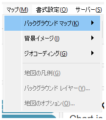

## Feature Differences
Rich map tab settings are a feature only available in Tableau Desktop.

- **Desktop**: Rich map tab settings are available for advanced map customization
- **Cloud**: Rich map tab settings are not available (only basic map menus)

## Usage Instructions
### Tableau Desktop
1. Create or select a map view.
2. Access rich map tab settings from the menu.
3. You can use advanced map customization options.

### Tableau Cloud
1. Create or select a map view.
2. Only basic map menus are available.

## Use Cases
- **Advanced Map Styling**: Desktop allows detailed map appearance adjustments
- **Custom Map Layers**: Management and configuration of multiple map layers
- **Detailed Geographic Data Display**: More precise geographic data visualization settings

## Notes and Considerations
- This feature is only available in Tableau Desktop
- Rich map tab settings cannot be accessed in Cloud
- Desktop usage is recommended when advanced map customization is needed
- This is classified as an operationally important feature

---
Reference: [GitHub Issue #26](https://github.com/mickitty0511/tableau-feature-parity/issues/26)