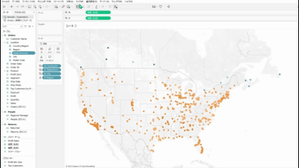
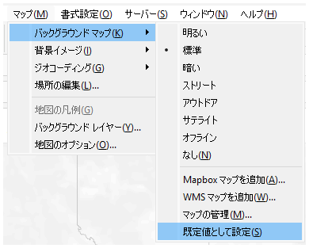
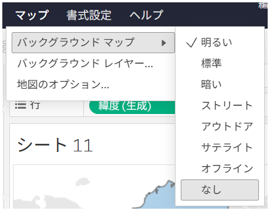

## 機能の違い
リッチマップタブ設定は、Tableau Desktopでのみ利用可能な機能です。

- **Desktop**: 高度なマップカスタマイズのためのマップタブ設定が利用可能
背景イメージ、場所の編集、カスタムジオコーディング
- **Cloud**: マップタブから一部機能が利用不可（基本的なマップメニューのみ）

## 使用方法
### Tableau Desktop
マップタブから以下の機能がDesktopのみ利用可能です。
- バックグラウンドマップ
     - Mapbox マップを追加
     - WMS マップを追加
     - マップの管理
     - 既定値として設定
- 背景イメージ
- 場所の編集
- カスタムジオコーディング

### Tableau Cloud
マップタブでは以下の機能がCloudのみ利用可能です。

## 使用例・ユースケース
- **高度なマップスタイリング**: Desktopでは詳細なマップ外観の調整が可能
- **カスタムマップレイヤー**: 複数のマップレイヤーの管理と設定
- **地理的データの詳細表示**: より精密な地理的データの可視化設定

## 注意事項と考慮点
- この機能はTableau Desktopでのみ利用可能です
- Cloudではリッチマップタブ設定にアクセスできません
- 高度なマップカスタマイズが必要な場合はDesktopの使用を推奨します
- 運用上重要な機能として分類されています

---
参照: [GitHub Issue #26](https://github.com/mickitty0511/tableau-feature-parity/issues/26)